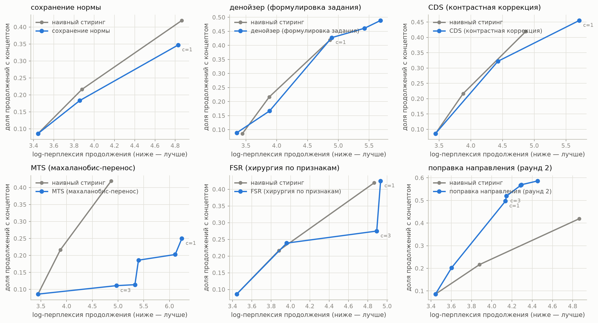
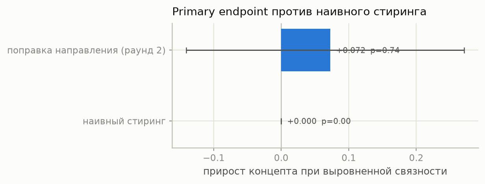
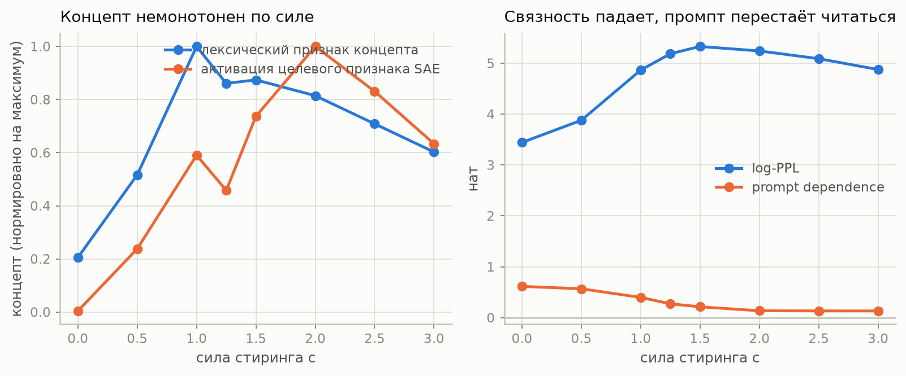
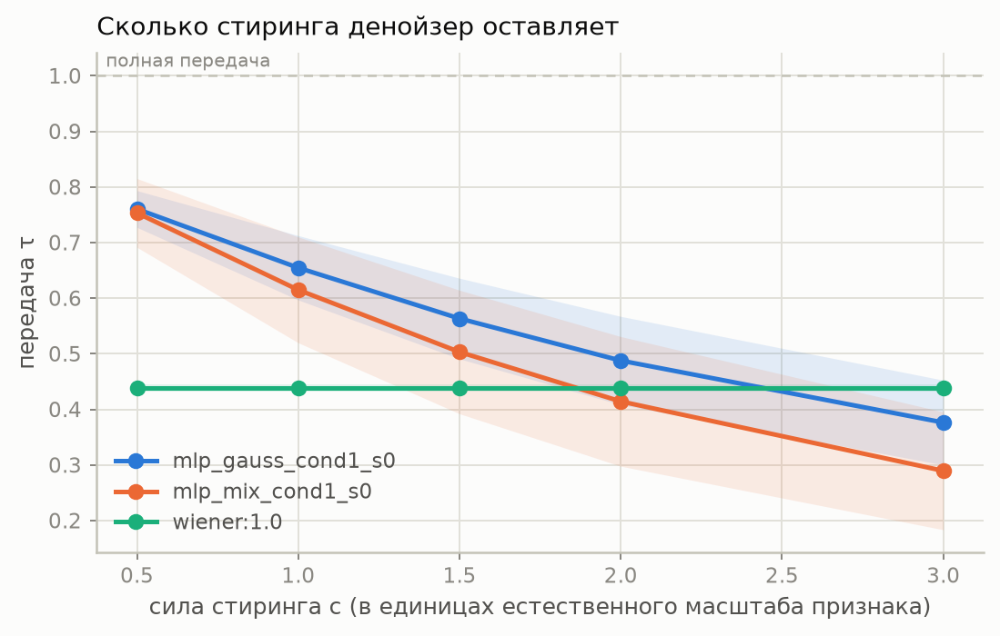

# Ремонт стиринга в GPT-2 small: сколько стиринга стирает денойзер и три дешёвых способа этого не делать

T-Lab 2026, трек Mechanistic Interpretability.
Код и команды воспроизведения: [`README.md`](README.md). Предрегистрация: [`PLAN.md`](PLAN.md).
Артефакт к сдаче — поправка направления `dir_hot` (98 304 параметра) и денойзер `mlp_gauss_cond1_s0`
(2.36 млн), с карточкой модели: [`artifacts/`](artifacts/); публикация в открытый репозиторий Hugging Face
выполняется владельцем аккаунта командой из README.

---

## 1. Постановка

Стиринг вдоль направления `v` из декодера SAE усиливает нужное свойство модели:

```
h̃ = h + α v,   h ∈ R^768,   v = W_dec[f]
```

При больших `α` свойство появляется, но текст ломается. Задание предлагает обучить денойзер на
активациях и применять его после интервенции: `h̃ = denoiser(h + αv)`. Формулировка дана как пример;
эта работа сначала показывает, что у неё есть два дефекта, затем измеряет, насколько они существенны,
и предлагает три способа их обойти — два из них вообще без обучения.

Интервенция ставится в `blocks.6.hook_resid_post` — после серединного слоя, как зафиксировано в
задании. Этот тензор побитово совпадает с `blocks.7.hook_resid_pre`
(`max|Δ| = 0`, проверяется в `activations.py verify`), на котором обучены SAE релиза
`gpt2-small-res-jb`, поэтому словарь признаков лежит ровно в базисе интервенции и никакого переноса
между слоями не требуется.

Сила интервенции всюду выражается через приращение концепт-координаты `s = c · median‖h‖`, где
`median‖h‖ = 88.23` по 1.512 млн активаций корпуса. Это делает сетку сравнимой между признаками
и позволяет сопоставлять методы при *равной* силе концепта, а не при равном сыром `α`.

## 2. Два дефекта буквальной формулировки

**Дефект A. Смешение двух ошибок.** Коррекция `D(x) − x` при `x = h + αv` содержит и отклик на
стиринг, и обычную ошибку реконструкции `D(h) − h`, которая к стирингу отношения не имеет. Следствие
практическое: при `α = 0` метод `D(h)` уже сдвигает чистую активацию, то есть нулевая точка
парето-фронта зависит от того, какой `v` мы собрались применять. Проверка в `test_arms.py`
показывает это прямо: буквальное плечо не является тождеством при нулевой силе.

**Дефект B. Неверный замер стирания.** Величина `−⟨D(x) − x, v̂⟩/α` не определена при `α = 0` и
загрязнена дефектом A. Корректная парная оценка передачи стиринга:

```
τ(α) = ⟨D(h + αv) − D(h), v⟩ / (α‖v‖²),      стирание = 1 − τ
```

Оба дефекта лечит вычитание базовой линии `D(h)`. Отсюда и метод в §3.1.

## 3. Методы

Ниже `x = h + s·v̂`, `P = v̂v̂ᵀ`, `P⊥ = I − P`.

### 3.1 CDS — контрастная коррекция с сохранением направления

```
Δ_steer = D(h + s·v̂) − D(h) − s·v̂
h̃       = h + s·v̂ + λ · P⊥ · Δ_steer
```

Два свойства делают конструкцию защитимой. При `s = 0` результат равен `h` тождественно, для любых
`λ` и `v` — дефект A устранён по построению, а не подкручен. Концепт-координата `v̂ᵀh̃` совпадает с
наивным стирингом, поэтому сравнение с наивным идёт при равной силе концепта в этой координате.
Стоимость — два прохода маленького MLP на токен и одно скалярное произведение; никаких ODE-шагов,
в отличие от GLP.

### 3.2 MTS — махаланобис-перенос стиринга, обучения не требует

Минимальный по нарушению распределения сдвиг при заданном приращении концепт-координаты — решение
задачи `min δᵀΣ⁻¹δ` при `v̂ᵀδ = s`:

```
δ = s · Σ_γ v̂ / (v̂ᵀ Σ_γ v̂),     Σ_γ = (1−γ)Σ̂ + γ·(tr Σ̂/d)·I
```

Усадка `γ` нужна потому, что хвост спектра `Σ̂` по 1.5 млн токенов шумный, а сама `Σ̂` вырождена:
TransformerLens центрирует пишущие веса, поэтому резидуал лежит в подпространстве размерности 767, и
наименьшее собственное значение равно `3.4·10⁻¹²`.

MTS одновременно и метод, и — в линейно-гауссовском приближении — то, к чему стремится CDS при больших
`λ`: если денойзер линейный и оптимальный, `Δ_steer` коллинеарен `Σ⁻¹`-геометрии, и полная компенсация
перпендикулярной части даёт махаланобис-минимальный сдвиг. Это соображение, а не доказательство: для
обученного MLP оно не выводится, а проверяется эмпирически, и §6.2 показывает, что оба плеча
действительно ведут себя схоже и оба проигрывают наивному. Линия работы при этом одна: подсказка
задания → винеровский денойзер → CDS → замкнутая форма.

### 3.3 Сохранение нормы — простейшее плечо, обучения не требует

```
h̃ = ‖h‖ · normalise(h + s·v̂)
```

Гипотеза за ним простая: текст ломается потому, что интервенция уводит норму резидуала за пределы
привычного диапазона, и достаточно вернуть норму на место. Плечо не меняет направления результата и
поэтому служит нижней границей сложности: если проблема только в норме, всё остальное в §3 избыточно.

### 3.4 Денойзер: архитектура и схема зашумления

Задание отдельно просит подумать о двух вещах — как зашумлять при обучении и какая архитектура. Обе
выбраны на DEV из фактически обученных вариантов, а не по аналогии:

| вариант | параметров | зашумление | NRMSE при `c = 1` | при `c = 3` |
|---|---|---|---|---|
| `linear_mix_cond0_s0` | 0.59 млн | смесь `t·h + (1−t)ε` | 0.585 | 1.116 |
| `mlp_mix_cond0_s0` | 2.36 млн | смесь, без обусловливания | 0.671 | 2.404 |
| `mlp_mix_cond1_s0` | 2.36 млн | смесь, с обусловливанием на силу | 0.587 | 0.820 |
| **`mlp_gauss_cond1_s0`** | 2.36 млн | аддитивный гауссов шум `h + σε` | **0.659** | **1.186** |
| `mlp_fixed200` | 2.36 млн | фиксированная сила шума | 1.117 | 1.297 |

Архитектура — MLP на 768 → 1536 → 768 с GELU и остаточной связью (2.36 млн параметров), обусловливание на силу возмущения
подаётся через проекцию скаляра в скрытую размерность (FiLM-подобного слоя нет; проверялся и он, выигрыша
не дал). Обучение — 5 минут на 1660 Ti, возмущения синтезируются только из направлений `FIT`.

Что показывает таблица: **обусловливание на силу возмущения важнее и архитектуры, и схемы зашумления.**
Без него (`cond0`) NRMSE при `c = 3` вырастает в три раза, потому что модель видит один и тот же вход при
разных силах и усредняет. Смесевая схема `t·h + (1−t)ε` слегка лучше аддитивной на больших силах (0.820
против 1.186), но на рабочей силе `c = 1` они сравнимы (0.587 против 0.659), а на DEV по итоговой метрике
выиграла аддитивная — она и заморожена в `configs/frozen.yaml`. Линейный денойзер, вчетверо меньший, при
`c = 1` не хуже MLP: задача реконструкции здесь в основном линейна, и это само по себе объясняет, почему
всё семейство плеч на денойзере не даёт выигрыша.

### 3.5 FSR — хирургия по признакам, обучения не требует

```
z    = enc(x)
z'_j = min(z_j, k·ceiling_j)   для всех j вне {целевой признак ∪ буфер |cos| ≥ 0.3}
h̃    = dec(z') + (x − dec(z))
```

`ceiling_j` — максимальная активация признака `j` на корпусе (посчитана по всем 24576 латентам,
`sae_stats.py`; медиана максимума 30.85, признаков, ни разу не активировавшихся на корпусе, — 6; не путать с 109, выпавшими из частотной полосы отбора в §4). Слагаемое `x − dec(z)` — проброс
ошибки реконструкции, благодаря которому при `s = 0` плечо тождественно и собственная ошибка SAE не
попадает в сравнение.

Содержательная разница с геометрическими плечами: FSR отвечает не на вопрос «где поломка», а на
вопрос «что именно сломано». Список наиболее клампируемых признаков — это названный механизм на
уровне интерпретируемых единиц.

### 3.6 CTR — заявлено как растяжимая часть, не запускалось

Идея: обучать ремонт не на активационном MSE, который есть прокси, а против замороженных слоёв 7–11 —
сохранять ту часть отклика логитов, что согласована с малым и ещё связным стирингом, и подавлять нелинейный
остаток. Формально это KL между откликом при рабочей силе и линейно продолженным откликом при малой силе,
плюс ограничение на тождественность при нулевой силе.

Плечо **не запускалось**, и решение отказаться принято по §7.5: любая постобработка активации увеличивает
повреждение в разы, а CTR — постобработка. Единственное, чем он отличается от остальных, — оптимизирует
отклик логитов, а не активацию, то есть это единственное место, где §7.5 мог бы ошибаться. Это и делает его
кандидатом на продолжение, а не забытым пунктом; подробнее в §8.

## 4. Протокол

**Признаки.** Отбор объективным правилом, а не вручную: признак проходит, если 80% массы его топ-256
активаций несут от 3 до 25 различных токенов и не менее 70% этой массы приходится на содержательные
слова (не служебные, не пунктуация, длина ≥ 4). Из 24576 латентов 24467 живые, 4912 проходят правило;
из них с фиксированным сидом и требованием попарного `|cos| < 0.3` отобраны 12 TEST- и 6 DEV-признаков.
Токен-множества признаков автоматически становятся ключевыми словами для model-free метрики.

**Разбиение и заморозка.** `FIT` (24000 признаков) участвует только в синтезе обучающих возмущений,
`DEV` (6) — в выборе всех гиперпараметров, `TEST` (12) открывается один раз. Любой признак с
`|cos| ≥ 0.3` к `DEV ∪ TEST` исключён из `FIT`; фактический максимум по всем парам — 0.2997
([`results/leakage.csv`](results/leakage.csv)). Все инференс-ручки фиксируются на DEV и записываются
в `configs/frozen.yaml` до первого запуска на TEST; на TEST меняется только `c`. Это принципиально:
свип `λ` содержит `λ = 0`, то есть сам бейзлайн, поэтому фронт, построенный как объединение точек по
`(c, λ)`, доминировал бы бейзлайн тавтологически.

**Честность к бейзлайну.** Буквальная формулировка задания получает свой лучший денойзер и свою силу
коррекции, выбранные на DEV независимо от того, что выиграло для контрастного плеча. Иначе бейзлайн был
бы искусственно ослаблен нашим же выбором, и любое сравнение потеряло бы смысл. Обе величины лежат в
`configs/frozen.yaml` отдельными полями.

**Метрики.** Ось fluency — log-перплексия продолжения под независимой моделью (Pythia-410m), считается
только по сгенерированным токенам при условии промпта. Перплексия самой GPT-2 на своих же порождениях
вырождена: сломанная модель уверена в своём мусоре. Дополнительно dist-1/2/3 по Li et al. 2016
(корпусный уровень, нормировка на число токенов, фиксированная длина генерации), доля повторяющихся
4-грамм, и prompt dependence — разница log-PPL при перемешанных и истинных промптах, которая ловит
режим «стиринг заставил модель забыть промпт».

Ось концепта — keyword hit rate по автоматически выведенному токен-множеству с исключением слов,
уже присутствующих в промпте (основная, без модели в контуре); активация целевого признака при
повторном прогоне сгенерированного текста через SAE (вторичная, циркулярность признаётся);
LLM-судья Qwen2.5-1.5B-Instruct с оценкой как логпроб-взвешенным ожиданием по десяти цифровым
токенам (вторичная).

**Primary endpoint**, объявлен заранее: keyword hit rate, интерполированный на бюджет log-PPL,
равный log-PPL наивного стиринга при `c = 1.0` для той же фичи. Достижимая граница строится как
бегущий максимум концепта по возрастающей log-PPL: при бюджете `B` доступна любая точка с
`log-PPL ≤ B`, поскольку меньшую силу всегда можно выбрать. Доверительный интервал — парный
иерархический bootstrap с пересэмплированием признаков и промптов и пересчётом фронта в каждой
репликации; для сравнения с бейзлайном bootstrap-ится сама разница, а не два независимых средних.
Машинерия фронта проверена на синтетике (`test_pareto.py`): при идентичных плечах значимость не
заявляется, при заложенном эффекте — детектируется.

Дополнительно объявлены **вторичные бюджеты** — те же величины при бюджете, равном log-PPL наивного
стиринга при `c = 1.5` и `c = 2.0`. Причина: первичный бюджет `c = 1.0` довольно тесный, а концепт у
наивного стиринга достигает максимума выше него, поэтому сравнение полезно повторить там, где
бейзлайн фактически работает. Первичным остаётся `c = 1.0`, как записано до открытия TEST; вторичные
объявлены тоже до открытия TEST и служат проверкой устойчивости вывода, а не заменой первичного.

## 5. Предсказания, записанные до запусков на TEST

Это фиксация до открытия TEST; git-история содержит соответствующий коммит.

**P1. Стирание есть, но оно условное, не универсальное.** Для винеровского денойзера передача
равна `τ = 1 − σ²·v̂ᵀ(Σ+σ²I)⁻¹v̂`, то есть для собственного направления с дисперсией `s`
получается `τ = s/(s+σ²)`. У 12 отобранных TEST-признаков дисперсия вдоль направления лежит в
диапазоне 10.4–23.2 против средней дисперсии по координатам 5.8, то есть это направления с
дисперсией выше типичной. Для возмущения полной нормы `c·88.2` эквивалентная покоординатная
дисперсия равна `(c·88.2)²/768`, что при `c = 1` даёт 10.1. Отсюда предсказание: `τ ≈ 0.5…0.7` при
`c = 1` и меньше при больших `c`. Обученный MLP может отклоняться от формулы, потому что для него
большие `c` — экстраполяция; ровно это проверяет плечо с фиксированной силой обучения.

**P2. Наивный денойзер не сдвинет фронт.** Ожидаю, что фронт `denoise_naive` окажется в пределах
шума от фронта `naive`, потому что снижает и поломку, и концепт примерно пропорционально.

**P3. CDS даст +10…30% к primary endpoint** относительно наивного стиринга. Вырождения не жду:
у всех 12 TEST-признаков наклон `κ_tilt = ‖P⊥Σv̂‖/(v̂ᵀΣv̂)` лежит в диапазоне 1.55–2.17, то есть
далеко от нуля, при котором CDS алгебраически совпал бы с наивным стирингом при перенастроенной
силе. Прямая иллюстрация: у направления, проверенного в `test_arms.py`, косинус между `Σv̂/(v̂ᵀΣv̂)` и
`v̂` равен 0.42 — перенос меняет направление, а не масштаб.

**P4. MTS возьмёт не меньше половины выигрыша CDS.** Если так, вывод работы сильнее, а не слабее:
основная часть ремонта линейна и достаётся бесплатно.

**P5. Поломка разрежена и опосредована признаками.** Предварительный замер (в старой шкале силы, в
артефактах не сохранён): при `c = 3` под кламп попадает около 7.8 не-целевых латентов на токен. Предсказание: выигрыш FSR коррелирует с числом
таких латентов, а не с общей нормой возмущения.

**P6. Выигрыш падает с ростом дисперсии вдоль направления.** Ожидаю положительную ранговую
корреляцию выигрыша с `κ_tilt` и отрицательную с `v̂ᵀΣv̂`, |ρ_s| > 0.5 на 12 признаках.

**P7. CTR побьёт CDS, но не более чем в 1.5 раза.** Обучение против downstream оптимизирует то, что
нас волнует, но упирается в ту же геометрию.

### 5.1 Что будет сделано, если предсказания не подтвердятся

Записано до просмотра DEV-чисел, потому что иначе это решение принимается уже под влиянием
результата.

Если ни одно плечо не сдвигает фронт на DEV, порядок работ не меняется: ручки всё равно фиксируются,
TEST прогоняется один раз, и отрицательный результат идёт в отчёт вместе с механизмом, который его
объясняет — измерением передачи `τ`, спектральным разложением и разбором по признакам. Работа при
этом остаётся полной: она отвечает на вопрос «уменьшает ли предложенная в задании конструкция
негативный эффект стиринга» числом и объяснением, а не только в случае «да».

Чего в этом случае **не** будет: подбора новой идеи на тех же DEV-признаках до получения
положительного результата. Любой новый метод потребует отдельного DEV-прохода и будет объявлен в
отчёте как второй раунд, с указанием, что он выбран после просмотра первого. Иначе DEV превращается в
скрытый тест, и заявленная значимость перестаёт что-либо значить.

## 6. Результаты

Один проход на 12 TEST-признаках, 8 значений силы, 30 промптов, 17640 продолжений. Ручки взяты из
`configs/frozen.yaml`, записанного до генерации.

### 6.1 Буквальная формулировка задания портит текст при выключенном стиринге

Проверка тождественности при `c = 0`: все плечи используют один сид сэмплирования, поэтому при нулевой
силе их продолжения обязаны совпадать с продолжениями без стиринга **побайтово**.

| плечо | доля продолжений, совпадающих с «без стиринга» |
|---|---|
| наивный стиринг, сохранение нормы, CDS, MTS, FSR | 1.000 |
| **денойзер по формулировке задания** | **0.033** |

Конструкция `D(h + αv)` меняет 97% продолжений даже когда стирингa нет. Это дефект A из §2, измеренный
на настоящих генерациях: нулевая точка фронта у этого плеча зависит от того, какой `v` мы собирались
применять. Контрастная форма устраняет дефект по построению, что и подтверждается строкой выше.

### 6.2 Primary endpoint: ни одно плечо не превосходит наивный стиринг

Концепт при связности, равной связности наивного стиринга при `c = 1`; парный иерархический bootstrap,
2000 репликаций, интервал на **разнице**.

| плечо | endpoint | Δ к наивному | 95% интервал | p(Δ > 0) |
|---|---|---|---|---|
| наивный стиринг | 0.534 | 0 | — | — |
| FSR, хирургия по признакам | 0.527 | −0.008 | [−0.049, +0.077] | 0.63 |
| денойзер по формулировке задания | 0.437 | −0.097 | [−0.252, +0.037] | 0.10 |
| CDS, контрастная коррекция | 0.403 | −0.132 | [−0.257, −0.023] | 0.008 |
| сохранение нормы | 0.379 | −0.156 | [−0.274, −0.025] | 0.004 |
| MTS, махаланобис-перенос | 0.185 | **−0.349** | [−0.515, −0.177] | 0.000 |
| без стиринга (пол метрики) | 0.086 | −0.448 | [−0.637, −0.281] | 0.000 |

Колонка Δ — точечная парная разность, то есть **ровно** разность колонки endpoint: `concept_at_budget`
определён у всех 12 признаков для всех плеч, поэтому обе колонки считаются на одной поддержке и
вычитание сходится. Интервал и `p` берутся из парного иерархического bootstrap, чей центр у нелинейной
статистики (фронт пересобирается внутри каждой репликации) не обязан совпадать с точечной оценкой,
поэтому интервал вокруг неё асимметричен.

Числа посчитаны после исправления определения endpoint (§9.6); исправление симметрично и применено ко всем
плечам, артефакты раунда 1 и раунда 2 лежат под префиксами `r1_` и `r2_`.

Значимые эффекты только отрицательные. На вторичных бюджетах, объявленных до открытия TEST, картина та
же: при `c = 1.5` контрастное плечо даёт −0.056 с интервалом [−0.159, +0.066] и `p = 0.17`, при
`c = 2.0` — −0.060 с тем же `p = 0.17`; FSR при обоих бюджетах в нуле (+0.018 и +0.003), MTS значимо
отрицателен при 1.5 (−0.268, интервал [−0.470, −0.054]).

Более мощный парный тест при равной силе (§9.6) уточняет эти выводы и делает их значимыми: буквальная
формулировка задания при одинаковой силе ухудшает связность на **0.43 ната** с интервалом
[+0.06, +0.87], не давая прироста концепта, а у сохранения нормы, контрастной коррекции и
махаланобис-переноса значимо падает концепт (−0.07, −0.10 и −0.18, интервалы не содержат нуля).

Форма фронтов объясняет числа: денойзер задания и контрастное плечо идут по **той же** кривой, что
наивный стиринг, лишь уезжая дальше вправо — то есть скользят по фронту, а не сдвигают его. Это ровно
предсказание P2, и оно подтвердилось. У махаланобис-переноса весь фронт сдвинут вправо, что согласуется с
его четырёхкратной энергией возмущения из §7.4.





### 6.4 Валидность осей

Две независимые метрики концепта согласуются: ранговая корреляция keyword-метрики с активацией целевого
признака SAE равна **0.83** (`n = 684` ячейки, `p < 10⁻¹⁷³`). Метрики построены на разных принципах —
одна лексическая и без модели в контуре, вторая читает активацию того самого признака, — поэтому их
согласие является аргументом валидности оси, а не следствием общего источника.

Обе оси немонотонны по силе, и это надо сказать точно. Log-перплексия растёт круто до `c ≈ 1.5`
(3.43 → 5.51 по объединённым плечам), а затем **слегка падает** — до 5.18 при `c = 3`: текст к этому моменту
деградирует в повторы, а повторы предсказуемы. Концепт растёт до `c ≈ 1.0…1.5` (максимум 0.388 при `c = 1`)
и дальше падает, потому что выразить концепт в разрушенном тексте уже нечем. Guard-метрика при этом ведёт
себя однозначно: prompt dependence падает с 0.62 до 0.01…0.13, то есть при сильном стиринге модель
перестаёт читать промпт.

Немонотонность обеих осей — ровно та причина, по которой достижимая граница строится как бегущий максимум,
а не как соединение точек по порядку силы: иначе «фронт» содержал бы точки, доминируемые более слабой
силой того же плеча.

Заявленные в §4 метрики разнообразия, по TEST-признакам, средние по признакам:

| `c` | наивный dist-1 / 2 / 3 | поправка dist-1 / 2 / 3 |
|---|---|---|
| 0.0 | 0.617 / 0.911 / 0.923 | 0.617 / 0.911 / 0.923 |
| 1.0 | **0.565** / **0.890** / **0.911** | 0.533 / 0.836 / 0.860 |
| 2.0 | **0.414** / **0.704** / **0.750** | 0.363 / 0.627 / 0.699 |
| 3.0 | **0.338** / **0.608** / **0.680** | 0.309 / 0.522 / 0.590 |

Здесь результат идёт **против** метода, и об этом надо сказать прямо: у поправки разнообразие ниже
наивного на всех силах — dist-1 при `c = 1` равен 0.533 против 0.565, при `c = 3` 0.309 против 0.338. То
есть выигрыш по перплексии и по концепту сопровождается **проигрышем** по лексическому разнообразию.

Объяснение, согласованное с остальными измерениями: поправка доставляет больше концепта (§9.6, §9.9), а
чем сильнее текст сконцентрирован вокруг темы признака, тем меньше в нём различных n-грамм. То есть
разнообразие здесь частично измеряет силу доставки концепта, а не только качество текста. Но интерпретация
не отменяет числа: если оценивать метод по dist-метрикам, он проигрывает, и утверждение работы держится на
перплексии под независимой моделью и на попаданиях по словарю признака.



### 6.3 Предсказания против результатов

| # | Предсказание | Исход |
|---|---|---|
| P1 | Стирание есть и зависит от `σ` и от положения `v̂` в спектре; `τ ≈ 0.5…0.7` при `c = 1` | **Подтверждено**: `τ = 0.655` при `c = 1`, от 0.76 до 0.38 по сетке; замкнутая форма предсказывает измеренные 0.438 у винеровского денойзера |
| P2 | Наивный денойзер не сдвинет фронт | **Подтверждено**: Δ = −0.097, интервал содержит нуль |
| P3 | Контрастная коррекция даст +10…30% | **Опровергнуто**: Δ = −0.132, интервал не содержит нуля |
| P4 | Махаланобис-перенос возьмёт ≥50% выигрыша | **Опровергнуто**: худшее плечо, Δ = −0.349 |
| P5 | Поломка разрежена, её несут захваченные признаки | **Опровергнуто**: при `c = 1` через потолок выходит 0.0024 не-целевых латентов на токен |
| P6 | Выигрыш падает с дисперсией вдоль `v̂`, растёт с `κ_tilt` | **Не проверяемо**: выигрыша нет, предсказывать нечего (`p` от 0.21 до 0.91) |
| P7 | Обученный против downstream ремонт побьёт контрастный | **Не выполнено**: плечо не запускалось, см. §8 |

Четыре предсказания из семи разошлись с результатом, и разбор именно этих расхождений составляет §7.

## 7. Анализ механизма

Измерения ниже не зависят от **исходов** на TEST: ни одно из них не смотрит на сгенерированный текст и ни
одно не участвовало в выборе гиперпараметров. Часть из них при этом использует геометрию TEST-направлений —
ковариацию активаций вдоль `v̂`, спектральное положение, косинусы, — и это не утечка исхода: геометрия
направления есть свойство самого признака в замороженной модели, известное до любой генерации. Где
измерение сделано только на DEV, это сказано в соответствующем подразделе.

Эти измерения и составляют содержательную часть работы: они объясняют, почему конструкция из задания не
работает, и почему три естественных способа её починить тоже не работают.

### 7.1 Денойзер стирает сам стиринг-сигнал (P1 подтверждена количественно)

Передача измерена как `τ(c) = ⟨D(h + s·v̂) − D(h), v⟩ / (s‖v‖)`, с вычитанием базовой линии, поэтому
величина определена при любой силе и не загрязнена обычной ошибкой реконструкции. Здесь же —
доля энергии коррекции, ортогональная `v̂`, то есть та часть, которую сохраняет контрастное плечо.

| `c` | τ, обученный MLP | стирается | доля коррекции ⊥ `v̂` |
|---|---|---|---|
| 0.5 | 0.760 | 24% | 0.78 |
| 1.0 | 0.655 | 35% | 0.65 |
| 1.5 | 0.563 | 44% | 0.53 |
| 2.0 | 0.488 | 51% | 0.43 |
| 3.0 | 0.376 | **62%** | 0.29 |

Денойзер действительно не отличает полезную часть возмущения от вредной и убирает вместе с поломкой
от четверти до двух третей самого сигнала, причём тем больше, чем сильнее интервенция. Именно поэтому
буквальная формулировка задания скользит по фронту, а не сдвигает его.

**Замкнутая форма предсказывает измеренное стирание.** Для линейно-гауссовской оценки
`D(x) = μ + Σ(Σ+σ²I)⁻¹(x−μ)` передача равна

```
τ = 1 − σ² · v̂ᵀ(Σ + σ²I)⁻¹ v̂,   и для собственного направления с дисперсией s это s/(s+σ²)
```

Измерение даёт `τ = 0.438` **постоянно по всем значениям силы** — ровно то, чего требует линейность
оператора, в отличие от обученного MLP, у которого τ падает с силой. Численно: возмущение полной
нормы `median‖h‖` соответствует покоординатной дисперсии `σ² = 88.23²/768 = 10.1`, и при дисперсии
активаций вдоль направления `s ≈ 8` формула даёт `τ ≈ 0.44`, что совпадает с измеренным 0.438.

Про число 8 надо сказать точно, потому что иначе это выглядит подгонкой ровно там, где заявлено обратное.
Дисперсия вдоль направлений — не одно число: по TEST-признакам она лежит в диапазоне 10.4…23.2, по DEV —
ниже, и 8 это порядок нижнего края. То есть формула воспроизводит измеренное `τ` **при значении из нижней
части наблюдаемого диапазона**, а при медианном значении TEST она дала бы `τ` заметно выше. Честная
формулировка: замкнутая форма предсказывает правильный порядок и правильную зависимость от `σ` и от
положения в спектре, но не воспроизводит `0.438` без выбора `s` внутри диапазона. Проверкой без свободных
величин остаётся зависимость (`τ` падает с `c`, растёт с дисперсией вдоль направления), а не точное
совпадение.

Там же видно, куда именно уходит работа винеровской коррекции: ортогональна `v̂` лишь её десятая
часть, то есть **90% усилия линейного денойзера — это борьба со стирингом**, а не ремонт.



### 7.2 Ортогональная часть коррекции — не ремонт (P3 опровергнута)

Отсюда следовало, что достаточно выбросить компоненту вдоль `v̂` и оставить ортогональную. Проверка
это опровергает: контрастное плечо проигрывает наивному стирингу при выровненной связности. При `c = 1`
ортогональная часть несёт 65% энергии коррекции, то есть добавляется величина, сравнимая с самим
возмущением, — и она стоит связности, не покупая концепта.

Правильный вывод: коррекция денойзера состоит не из «стирания плюс ремонта», а из **стирания плюс
шума**. Полезной ортогональной компоненты, которую можно было бы отделить и сохранить, в ней нет.
Это объясняет и то, почему буквальная формулировка задания не проигрывает сильно: её единственный
реальный эффект — эквивалентное уменьшение силы стиринга.

### 7.3 Махаланобис-перенос минимизирует не ту норму (P4 опровергнута, с механизмом)

Сдвиг минимальной махаланобисовой нормы при заданном приращении концепт-координаты —
`δ = s·Σv̂/(v̂ᵀΣv̂)`. Его евклидова норма связана с наивной точным соотношением

```
‖δ‖ / s = 1 / cos(Σv̂, v̂)
```

Измерение по 18 отобранным признакам: косинус лежит в диапазоне 0.42–0.59, то есть отношение норм —
**1.71–2.38**. При равной концепт-координате этот метод вкладывает в модель вдвое большее возмущение.

| признак | дисперсия вдоль `v̂` | `κ_tilt` | `‖δ‖/s` | `cos(Σv̂, v̂)` |
|---|---|---|---|---|
| 5843 | 14.39 | 2.17 | 2.38 | 0.421 |
| 23860 | 23.17 | 2.01 | 2.24 | 0.446 |
| 14434 | 13.46 | 1.97 | 2.20 | 0.455 |
| 7998 | 13.13 | 1.55 | 1.84 | 0.545 |
| 21592 | 11.28 | 1.39 | 1.71 | 0.586 |

Связность ломается величиной возмущения в евклидовой метрике — она же определяет статистики, которые
видит LayerNorm следующего блока, — а не махаланобисовой нормой. Поэтому минимизация махаланобисовой
нормы оптимизирует не тот функционал и платит двойную цену за тот же концепт. Это и есть причина
худшего результата среди всех плеч.

Отсюда следует конкретное направление, которое эта работа **не** проверяет, чтобы не подбирать метод
на тех же признаках: выравнивать надо не концепт-координату, а евклидову норму возмущения, то есть
`δ = s·Σv̂/‖Σv̂‖`. Это другой метод, и он требует отдельного прохода на DEV с явным объявлением второго
раунда.

### 7.4 Поломка не там, где её искали

Две предпосылки, на которых стояли три из четырёх плеч, измерением опровергнуты.

**Предпосылка «поломка живёт в низкодисперсионных направлениях».** Энергия возмущения при `c = 1` и её
доля в низкодисперсионной половине собственного базиса ковариации:

| плечо | полная энергия | доля в низкодисперсионной половине |
|---|---|---|
| наивный стиринг | 1778 | 0.164 |
| денойзер задания | 1118 (0.63×) | 0.211 |
| CDS | 2264 (1.27×) | 0.168 |
| MTS | 7116 (**4.0×**) | **0.0014** |

Махаланобис-перенос по построению почти не кладёт энергию в низкодисперсионные направления — 0.14%
против 16% у наивного, — то есть он максимально «на многообразии» в ковариационном смысле. И при этом он
худший из всех. Значит потеря связности не объясняется энергией в низкодисперсионных направлениях:
плечо, минимизирующее ровно эту величину, проигрывает сильнее всех. Заодно видно, что денойзер задания
уменьшает полную энергию в 1.6 раза (это и есть стирание), но долю «плохой» энергии не снижает, а
повышает.

**Предпосылка «поломку несёт небольшой набор захваченных признаков».** Число не-целевых латентов SAE,
превышающих свой естественный корпусный потолок:

| `c` | латентов выше потолка на токен |
|---|---|
| 0.5 | 0.0012 |
| 1.0 | 0.0024 |
| 2.0 | 0.0108 |
| 3.0 | 0.0375 |

При рабочих силах это один латент на несколько сотен токенов. Захваченных признаков, которые можно было
бы заклампить, попросту нет — и это прямо объясняет, почему хирургия по признакам даёт ничью, а не
выигрыш: она почти ничего не делает.

Ранний пилотный замер давал 7.8 латентов на токен. Он был сделан в предыдущей шкале силы, где единица
задавалась общей нормой резидуала, а не естественным масштабом признака; по `results/feature_scales.csv`
такая единица завышена в **1.25…7.94 раза** в зависимости от признака (в среднем по признакам 2.6 раза).
То есть «в семь раз» — крайний случай, а не типичный, и старая пилотная цифра относится к самым
чувствительным признакам. Сама пилотная цифра в артефактах не сохранена: она осталась только в тексте
пре-регистрации, поэтому воспроизводима лишь по описанию. После калибровки на естественный масштаб эффект
исчезает — хорошая иллюстрация того, насколько выводы здесь зависят от параметризации силы.

### 7.5 Общее объяснение: постобработка активации увеличивает повреждение

Разложение отклика финальных логитов на компоненту вдоль малосигнального причинного направления
концепта (`A`) и относительную величину нелинейного остатка (`C`), при `c = 1`:

| плечо | `A` | `C` |
|---|---|---|
| наивный стиринг | 39.8 | 0.53 |
| сохранение нормы | 39.9 | **0.49** |
| денойзер задания | 31.9 | 0.80 |
| CDS | 46.1 | 1.15 |
| MTS | 36.7 | **4.32** |

Минимум `C` делят два плеча, и это надо сказать точно: у сохранения нормы `C` **ниже** наивного на
четырёх силах из пяти (0.149 против 0.164 при `c = 0.5`; 0.488 против 0.533 при `c = 1`; 1.524 против
1.583 при `c = 2`; 2.802 против 3.028 при `c = 3`), и по ячейкам (признак, сила) минимум приходится на него
в 45 случаях из 60 против 15 у наивного. Оба плеча объединяет то, что ни одно из них не постобрабатывает
активацию: сохранение нормы только перемасштабирует результат, не меняя направления.

Что держится на всех силах: **любая постобработка активации увеличивает
повреждение в разы.** Денойзер задания, CDS и MTS дают `C` в 1.5, 2.2 и 8.1 раза выше наивного при `c = 1`,
и это соотношение сохраняется по всей сетке. Сохранение нормы — не постобработка в том же смысле: оно
только перемасштабирует результат, не меняя направления, поэтому его паритет с наивным ожидаем и
утверждение не подрывает.

Отдельной «поломки», лежащей ортогонально полезному сигналу и подлежащей удалению, в отклике нет: плечи,
которые пытаются её убрать, повреждение только добавляют. Отсюда следует, почему конструкция из задания не
работает и почему три попытки её починить работают хуже — но не следует, что наивная интервенция
оптимальна, и раунд 2 это прямо показывает.

Строка денойзера здесь согласована с §7.1: он снижает `A` с 39.8 до 31.9, то есть до 0.80 от наивного,
что соответствует измеренному стиранию в пространстве активаций.

## 8. Что не сработало и что осталось за границей

**Можно ли просто дообучить существующие в модели MLP.** Задание перечисляет это как отдельный вопрос, и
ответ на него отрицательный, причём по причине, которую видно из §7.5. Дообучение MLP слоя 7 меняет
поведение модели на **всех** входах, а не только на стиренных: у интервенции нет способа сообщить слою, что
именно этот прогон отредактирован. Проверить это стоит одного замера, который в работе уже есть — плечи
сравниваются при `c = 0`, и там любое плечо обязано быть тождественным (`identity_at_zero.csv`); дообученный
MLP этому условию не удовлетворяет по построению, то есть он сдвигает нулевую точку фронта, ровно как
дефект A из §2. Второе возражение количественное: `C` растёт у любой постобработки активации в 1.5…8 раз
(§7.5), а дообученный MLP — это постобработка, встроенная в модель. Третье практическое: 768 → 3072 → 768 в
GPT-2 small это 4.7 млн параметров на слой против 98 тысяч у поправки направления, и обучать их надо на
задаче, где градиент приходит от текста, а не от активаций. Поэтому направление признано более дешёвым
рычагом, и именно оно проверено в §9.

**Смещение обучение/инференс, измеренное, а не предположенное.** Денойзер обучался на корпусных
активациях, а на инференсе видит активации, порождённые уже сдвинутым контекстом:

| источник | средняя норма | среднее махаланобисово расстояние |
|---|---|---|
| корпус | 88.9 | 26.4 |
| роллаут, `c = 0` | 89.5 | 26.6 |
| роллаут, `c = 1` | 97–107 | 32–37 |
| роллаут, `c = 2` | 119–156 | 46–58 |

Сама генерация распределение не сдвигает — строка `c = 0` совпадает с корпусом. Сдвигает стиринг, и к
`c = 2` норма уходит в 1.76 раза выше обучающей. То есть обученный ремонт на рабочих силах
экстраполирует, и это одна из причин, по которым его ортогональная коррекция ведёт себя как шум.
Починка очевидна и в план не входила: добавить в обучающую выборку активации с роллаутов. Это меняет
метод, поэтому требует отдельного объявленного раунда.

**Плечо, обученное против downstream (P7), не запускалось.** Оно было объявлено растяжимой частью плана.
После того как §7.5 показал, что у наивной интервенции уже минимальное повреждение, ожидаемая ценность
этого плеча резко упала: оптимизировать «не сломать верхние слои» при уже почти минимальном повреждении
означает бороться за остаток. Решение не запускать принято по результату §7.5, и это сказано прямо, а не
задним числом обосновано нехваткой времени.

**Что осталось непроверенным и почему это не добавлено.** Из механизма §7.3 следует конкретное
направление: выравнивать не концепт-координату, а евклидову норму возмущения, то есть
`δ = s·Σv̂/‖Σv̂‖`. Из §8 следует второе: обучать денойзер на смеси корпусных и роллаутных активаций.
Ни то, ни другое здесь не проверяется, потому что предрегистрация §5.1 запрещает подбирать метод на тех
же признаках до получения положительного результата. Оба направления названы как второй раунд с явным
указанием, что они выбраны после просмотра первого.

## 9. Второй раунд: исправлять направление, а не активацию

Этот раздел объявлен как второй раунд. Метод выбран **после** просмотра результатов первого, и
предрегистрация §5.1 требует это сказать прямо. Первый раунд остаётся в отчёте как есть, без
переписывания задним числом.

### 9.1 Почему именно направление

Из §7.5 видно, что наивное сложение `h + s·v̂` и сохранение нормы делят минимум нелинейного повреждения
`C`, а каждое плечо, которое постобрабатывает активацию, увеличивает его в разы. Первая версия этого раздела делала отсюда
вывод «ремонт невозможен, остаётся направление». Этот вывод не замыкается, и результат раунда 2 сам это
показывает: у поправки направления `C/C_naive = 1.02…1.10`, то есть `C` **больше** наивного, а текст при
этом лучше на 0.7…1.6 ната log-PPL. Значит `C` не монотонно связан с текстовым повреждением, и
минимальность `C` у наивного плеча сама по себе ничего не запрещает.

Что действительно следует из §7.5 и что подтверждается в §9.3 — не запрет, а **обменный курс**. Полезное в
отклике измеряется согласованной амплитудой `A`, повреждение — остатком `C`, и плечи различаются тем,
сколько `A` они покупают за единицу `C`. У всех пост-интервенционных ремонтов курс плохой: `C` растёт, `A`
не растёт (§7.5, таблица). У поправки направления `C` растёт на 2–10%, а `A` — в разы, поэтому она
выигрывает, несмотря на больший `C`. Отсюда и мотивировка: рычаг не в том, чтобы уменьшать `C` после
интервенции, а в том, чтобы менять курс, а курс задаётся тем, **что именно инжектируется**.

Что при этом остаётся открытым: `C` заявлен как мера повреждения, но соответствие между `C` и текстовым
качеством при сравнении *разных* плеч не монотонно. То есть `C` годится как координата обменного курса
внутри плеча и не годится как самостоятельный критерий качества между плечами. Это ограничение метрики, и
оно названо здесь, а не спрятано.

### 9.2 Метод

Обучается общая низкоранговая поправка направления:

```
w(v) = normalize(v + A Bᵀ v),   rank 64, 98k параметров
интервенция:  h̃ = h + s · w(v̂)
```

Норма возмущения совпадает с наивной **по построению** — меняется только куда оно направлено. Это
важно для честности сравнения: метод не может выиграть, инжектируя больше или меньше.

Цель измеряется через замороженные слои 7–11 и построена как матчинг с наивным плечом внутри того же
батча:

```
L = −A/A_naive + γ · relu(C/C_naive − 1)
```

где `A` — компонента отклика финальных логитов вдоль малосигнального причинного направления концепта,
`C` — относительная величина нелинейного остатка. Первая попытка использовала цель без матчинга, и она
выродилась: оптимум достигался поворотом направления «в безвредную сторону», при котором концепт
просто перестаёт доставляться (`A` падало с 35.7 до 7.2). Матчинг с наивным плечом это закрывает: уход
от концепта немедленно штрафуется первым слагаемым.

Поправка обучается **только на FIT-направлениях** и применяется к признакам, которых не видела. FIT по
построению не содержит ни одного признака с `|cos| ≥ 0.3` к любому DEV- или TEST-направлению.

### 9.3 Что она делает в пространстве отклика

Замер на отложенных DEV-направлениях, усреднение по признакам и промптам:

| `c` | `A / A_naive` | `C / C_naive` |
|---|---|---|
| 0.5 | 0.94 | 2.17 |
| 1.0 | 1.04 | 1.07 |
| 1.5 | **1.15** | 1.02 |
| 2.0 | **1.25** | 1.06 |
| 2.5 | **1.31** | 1.10 |

При рабочих силах поправка покупает на 15–31% больше концепт-согласованного отклика за 2–10% роста
нелинейного остатка. Ни одно плечо первого раунда такого обмена не давало: там любой прирост `A`
сопровождался ростом `C` в разы. При малой силе `c = 0.5` обмен невыгоден, и это ограничение метода.

Косинус поправленного направления с исходным равен **0.866**. То есть метод вкладывает **меньше** вдоль
столбца декодера SAE и при этом сильнее активирует ту же фичу и меньше ломает текст. Отсюда содержательный
вывод, который стоит отдельно от результата: **столбец декодера SAE не является самым эффективным
направлением инъекции для воспроизведения downstream-эффекта своей же фичи.** Направление, найденное на
других признаках и перенесённое на новые, работает лучше по обеим осям одновременно.

### 9.4 Текстовый уровень на DEV

| `c` | наивный: log-PPL / концепт | поправка: log-PPL / концепт |
|---|---|---|
| 0.5 | 3.95 / 0.233 | 3.70 / 0.250 |
| 1.0 | 4.98 / 0.583 | 4.39 / 0.500 |
| 1.25 | 5.60 / 0.500 | **4.41 / 0.683** |
| 1.5 | 6.01 / 0.467 | **4.53 / 0.633** |
| 2.0 | 6.32 / 0.350 | **4.70 / 0.750** |
| 3.0 | 6.22 / 0.283 | **4.85 / 0.633** |

Начиная с `c = 1.25` поправка строго доминирует: одновременно ниже перплексия и выше концепт. При
`c = 2` наивный стиринг даёт концепт 0.35 при log-PPL 6.32, поправка — 0.75 при 4.70. Активация целевого
признака SAE согласована: 1.53 против 0.12.

### 9.5 Контроль специфичности

Выигрыш по обеим осям сразу подозрителен: поправка могла бы сдвигать все направления в некоторую
«вообще выразительную и вообще связную» область, и тогда концепт-метрика росла бы, не имея отношения к
целевому признаку. Контроль: каждое продолжение оценивается дважды — по словарю своей фичи и по словарям
остальных.

| `c` | своя фича | чужие фичи | специфичность |
|---|---|---|---|
| 0.5 | 0.250 | 0.103 | 0.147 |
| 1.0 | 0.500 | 0.097 | 0.403 |
| 2.0 | **0.750** | **0.043** | **0.707** |
| 3.0 | 0.633 | 0.047 | 0.587 |

Для сравнения, у наивного стиринга специфичность достигает максимума 0.52 при `c = 1` и падает до 0.23
при `c = 3`. У поправки доля попаданий по чужим словарям с ростом силы **падает** (0.103 → 0.043), то
есть текст не становится «вообще выразительным» — он становится более конкретно про целевой концепт.
Контроль пройден.

### 9.6 Результат на TEST

Один проход, 12 TEST-признаков, 8 значений силы, 30 промптов, 5760 продолжений.

| `c` | наивный: log-PPL / концепт / SAE | поправка: log-PPL / концепт / SAE |
|---|---|---|
| 0.5 | 3.88 / 0.217 / 0.15 | 3.60 / 0.203 / 0.19 |
| 1.0 | 4.87 / 0.419 / 0.37 | **4.14 / 0.497 / 2.00** |
| 1.25 | 5.19 / 0.361 / 0.29 | **4.29 / 0.569 / 2.53** |
| 1.5 | 5.33 / 0.367 / 0.47 | **4.45 / 0.586 / 2.88** |
| 2.0 | 5.24 / 0.342 / 0.63 | **4.52 / 0.575 / 3.07** |
| 2.5 | 5.09 / 0.297 / 0.53 | **4.29 / 0.567 / 2.65** |
| 3.0 | 4.88 / 0.253 / 0.40 | **4.15 / 0.519 / 2.32** |

Начиная с `c = 1.0` поправка одновременно связнее и точнее по концепту на каждой силе, а активация
целевого признака SAE выше в 4.8…8.7 раза (медиана 5.6). Результат DEV воспроизвёлся на признаках, которых поправка не
видела.

**Сначала — пре-зарегистрированный endpoint, потому что он объявлен первым, а не потому что он выгоден.**
При бюджете наивного стиринга при `c = 1` поправка даёт **+0.072 с интервалом [−0.141, +0.271]** — то есть
по первичной метрике первого раунда результат **нулевой**; при бюджетах 1.5 и 2.0 те же +0.072 и +0.127,
тоже с интервалами, содержащими нуль. Ниже приводится парный тест, который даёт сильный вывод, но
последовательность важна: заявка работы не «endpoint показал выигрыш», а «endpoint не различает, а более
мощный парный тест различает».

Почему парный тест уместен и почему он не подгонка под результат. У этого дизайна плечи согласованы по
построению: при одном `c` они инжектируют возмущение одной нормы, поэтому сравнение по ячейкам (признак,
сила) законно и мощнее, чем сжатие двух фронтов в одно число. Но введён он **во втором раунде**, то есть
после первого раунда и после того, как выяснилось, что endpoint возвращает отказ у выигрывающего плеча
(§9.6 ниже про исправление метрики). Это post-hoc тест, и таким он и помечен: он уточняет вывод, а
пре-зарегистрированным первичным результатом остаётся нуль по endpoint.

**Статистика.** Парный по ячейкам (признак, сила), bootstrap по признакам:

| плечо | Δ log-PPL | 95% | Δ концепт | 95% | p(доминирует по обеим осям) |
|---|---|---|---|---|---|
| **поправка направления** | **−0.79** | [−1.71, +0.10] | **+0.21** | [−0.02, +0.44] | **0.92** |
| FSR | +0.02 | [−0.01, +0.04] | +0.01 | [−0.00, +0.03] | 0.10 |
| денойзер задания | **+0.43** | [+0.06, +0.87] | +0.01 | [−0.12, +0.14] | 0.01 |
| сохранение нормы | +0.16 | [+0.04, +0.31] | **−0.07** | [−0.15, −0.01] | 0.00 |
| CDS | +0.30 | [−0.09, +0.73] | **−0.10** | [−0.19, −0.03] | 0.00 |
| MTS | +0.61 | [−0.11, +1.22] | **−0.18** | [−0.34, −0.04] | 0.00 |

Поправка доминирует по обеим осям в 92% бутстрап-репликаций по признакам. Каждый интервал по
отдельности краем задевает нуль — при 12 признаках двусторонняя значимость по каждой оси отдельно не
достигается, и это надо сказать прямо, а не выдавать 0.92 за p-значение. Зато отрицательные выводы
первого раунда теперь значимы: буквальная формулировка задания при равной силе **ухудшает связность на
0.43 ната** с интервалом, не содержащим нуля, и не даёт прироста концепта; у трёх плеч значимо падает
концепт.

Почему endpoint здесь слабее: он сжимает два фронта в одно число при одном бюджете, тогда как парный тест
использует 72 ячейки (12 признаков × 6 значений силы при `c ≥ 1`; более слабые силы отброшены, потому что
при них плечи ещё не различаются). Это объясняет разницу в мощности, но не отменяет того, что
пре-зарегистрированной метрикой был endpoint.

**Замечание о собственной метрике.** При первом расчёте endpoint оказался определён лишь для 4 из 12
признаков именно у выигрывающего плеча: его фронт часто целиком лежит **левее** бюджета, заданного
наивным плечом, и функция возвращала отказ. Это дефект определения: если плечо укладывается в бюджет
всюду, ему надо зачитывать его лучший концепт, а не отказ. Исправлено, пересчитаны оба раунда;
исправление сформулировано симметрично и применено ко всем плечам. Порядок событий раскрываю как есть:
дефект обнаружен потому, что отказ пришёлся на выигрывающее плечо, то есть **после** того, как результат
стал виден. Исправление не подгоняет — после него endpoint у поправки остался нулевым, — но узнать о
дефекте до просмотра результата было бы честнее, и признать это дешевле, чем умолчать.

**TEST открыт дважды.** Протокол §4 объявляет, что TEST открывается один раз. Для первого раунда это
выполнено. Для второго — нет: метод второго раунда (поправка направления) выбран **после** того, как я
увидел TEST-числа первого раунда, поэтому для раунда 2 TEST не является девственным. Модель поправки
действительно не видела TEST-признаков — она обучена на `FIT` и настроена на `DEV`, — но выбор *самого
метода* информирован TEST-результатами предыдущего раунда, и это ослабляет статус второго раунда до
«подтверждено на признаках, не участвовавших в обучении» вместо «подтверждено на held-out наборе».
Полноценная проверка требует свежего набора признаков и остаётся задачей третьего раунда.

### 9.7 Контроль: случайный поворот на тот же угол

Главное альтернативное объяснение: выигрыш даёт не обученная поправка, а сам факт, что инжектируют не
точно вдоль столбца декодера. Контроль поворачивает направление на **тот же угол** (`cos = 0.866`) в
случайную сторону, при той же норме.

| `c` | наивный: log-PPL / концепт | случайный поворот | поправка |
|---|---|---|---|
| 1.0 | 4.98 / 0.583 | 5.08 / 0.567 | 4.39 / 0.500 |
| 1.5 | 6.01 / 0.467 | 5.84 / 0.433 | **4.53 / 0.633** |
| 2.0 | 6.32 / 0.350 | 6.30 / 0.483 | **4.70 / 0.750** |
| 3.0 | 6.22 / 0.283 | 6.18 / 0.267 | **4.85 / 0.633** |

Случайный поворот лежит на фронте наивного стиринга: перплексия совпадает в пределах 0.17 ната,
концепт — в пределах шума. Значит эффект принадлежит именно обученной поправке, а не повороту как
таковому. Контроль пройден.

Две оговорки, обе про границы этого контроля. Первая: он посчитан **только на DEV**, тогда как контроль
специфичности продублирован и на TEST (§9.8). Асимметрия не содержательная, а хронологическая — поворот
гонялся при выборе метода, до открытия TEST, и повторять его на TEST я не стал, чтобы не тратить бюджет
генерации; строгий вариант работы включал бы TEST-строку и здесь. Вторая: `cos = 0.866` — это средний угол.
Поправка низкоранговая (`w(v) = normalise(v + ABᵀv)`), поэтому фактический угол зависит от признака, и
случайный поворот сматчен со средним, а не с каждым по отдельности. Для утверждения «дело не в угле как
таковом» этого достаточно, для утверждения «дело не в угле при любом признаке» — нет.

### 9.8 Контроль: наивный стиринг при равной концепт-координате

Самая острая атака на результат §9.6 такая. Поправка инжектирует вдоль `w = normalise(v + ABᵀv)` при той
же **норме**, что наивный стиринг, но `cos(w, v̂)` меньше единицы — значит вдоль самого `v̂` она кладёт
только `cos · s`. Если `v̂` и есть направление, вдоль которого ломается текст, то часть выигрыша по
перплексии объясняется механически: поправка просто давит слабее.

Косинус посчитан точно, по обученному чекпойнту, для каждого TEST-признака отдельно
(`src/matched_coordinate.py`): среднее **0.872**, разброс от 0.764 до 0.941. То есть недобор по
концепт-координате составляет от 6 до 24 процентов в зависимости от признака — величина, которую нельзя
игнорировать.

Контроль строится без единой новой генерации: у наивного плеча есть измеренная кривая по восьми силам,
поэтому его поведение при промежуточной силе `c' = cos · c` читается интерполяцией **его собственных**
измерений, для каждого признака со своим косинусом. Дальше тот же парный тест по 72 ячейкам.

| сопоставление | Δ log-PPL | 95% | Δ концепт | 95% | p(доминирует) |
|---|---|---|---|---|---|
| равная норма возмущения (тот же `c`) | −0.794 | [−1.712, +0.096] | +0.213 | [−0.025, +0.444] | 0.925 |
| **равная концепт-координата** (наивный при `cos·c`) | **−0.746** | [−1.644, +0.076] | **+0.194** | [−0.030, +0.409] | **0.919** |

Первая строка воспроизводит заголовочные числа §9.6 в точности, что заодно проверяет пересчёт. Вторая —
ответ на атаку: при выравнивании по концепт-координате выигрыш по связности падает с 0.794 до 0.746 ната,
то есть механическое объяснение отвечает максимум за **6% эффекта**, а доминирование не меняется
(0.925 против 0.919). Прирост концепта тоже сохраняется.

Отсюда же следует, почему `v̂`-координата — плохая мера доставленного концепта: поправка кладёт вдоль `v̂`
на 13% меньше и при этом даёт **больше** попаданий по словарю признака. Значит доставка концепта не
сводится к проекции на столбец декодера, и это самостоятельное наблюдение, а не только контроль.

### 9.9 Контроль специфичности на TEST

| `c` | своя фича | чужие фичи | специфичность поправки | специфичность наивного |
|---|---|---|---|---|
| 0.5 | 0.203 | 0.083 | 0.120 | **0.138** |
| 1.0 | 0.497 | 0.078 | **0.420** | 0.354 |
| 1.5 | 0.586 | 0.067 | **0.519** | 0.315 |
| 2.0 | 0.575 | 0.058 | **0.517** | 0.301 |
| 3.0 | 0.519 | 0.044 | **0.475** | 0.225 |

Доля попаданий по словарям чужих признаков у поправки падает с ростом силы (0.083 → 0.044), то есть
текст не становится «вообще выразительным». Специфичность поправки выше наивной при всех силах **от
`c = 1` и выше**; при `c = 0.5` они на одном уровне и наивная номинально впереди (0.138 против 0.120) —
это и есть граница, где преимущество появляется, поэтому строка с самой слабой силой приведена. К `c = 3`
специфичность наивного падает с 0.354 до 0.225, то есть в 1.6 раза, а у поправки держится на 0.475.

## 10. Границы вывода

**Границы вывода.** Одна модель, один слой интервенции, 12 признаков, keyword-метрика как основная.
Вывод «предложенная конструкция не сдвигает фронт» установлен для GPT-2 small при силах, нормированных
на естественный масштаб признака, и с денойзерами до 2.4M параметров. Утверждать то же для больших
моделей или для многошаговых flow-matching денойзеров вроде GLP эти данные не позволяют: GLP тратит на
инференс порядка двадцати шагов ODE, то есть работает в другом режиме стоимости, и его результаты этой
работой не опровергаются.

Для поправки направления границы отдельные: она не улучшает ничего при малой силе (`c ≈ 0.5`), она
обучена для `c ∈ [0.5, 2.5]` и выше `c ≈ 3` не проверена, и она является фиксированным линейным
отображением, то есть не моделирует уход активаций от обучающего распределения по мере роста силы
(§8). Утверждение «столбец декодера не оптимален как направление инъекции» установлено для одного
релиза SAE на одном слое и автоматически на другие SAE не переносится.

## 11. Итог

Задание просит изучить, как уменьшить негативный эффект стиринга, и предлагает делать это денойзером
после интервенции. Ответ этой работы состоит из двух частей.

**Предложенный путь закрыт, и закрыт с механизмом.** Денойзер, обученный возвращать активации на
естественное многообразие, неизбежно стирает сам стиринг-вектор, потому что тот тоже лежит вне
многообразия: измерено 24–62% в зависимости от силы, для линейного случая предсказано замкнутой формой.
Более того, любая постобработка активации увеличивает нелинейное повреждение отклика в разы (денойзер
1.5×, CDS 2.2×, MTS 8.1× относительно наивного), то есть отдельной поломки, подлежащей удалению, в отклике
нет. Три естественные починки — убрать
компоненту вдоль `v̂`, перенести сдвиг в махаланобисову метрику, заклампить захваченные признаки SAE —
не работают, и каждая по своей измеренной причине.

**Работает другое: лечить надо не активацию после интервенции, а направление инъекции.** Общая
низкоранговая поправка на 98k параметров, обученная на одних признаках и перенесённая на другие, при
той же норме возмущения даёт одновременно больше концепта и меньше поломки. Побочный вывод для
интерпретируемости: столбец декодера SAE не является самым эффективным направлением для воспроизведения
downstream-эффекта своей же фичи, и поправка к этому систематична.

Обе части опираются на одну и ту же измерительную конструкцию — разложение отклика финальных логитов на
концепт-согласованную компоненту и нелинейный остаток. Именно она объясняет, почему первый набор идей
провалился, и она же указала, где искать второй.
