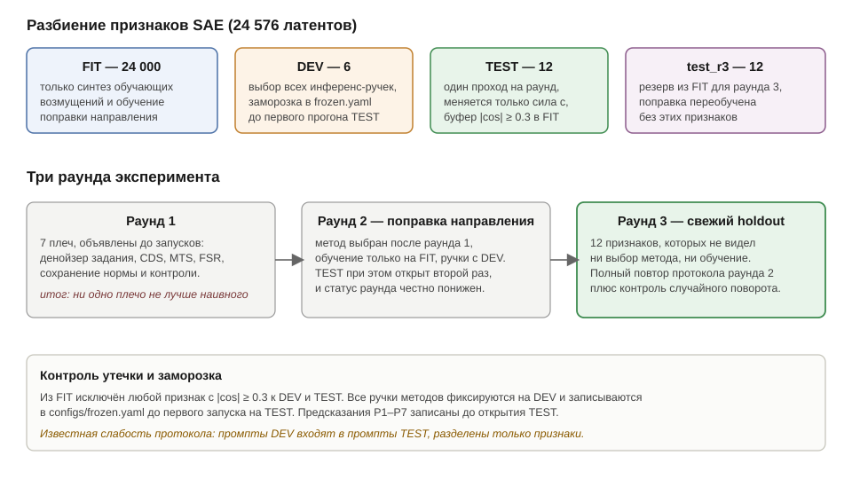
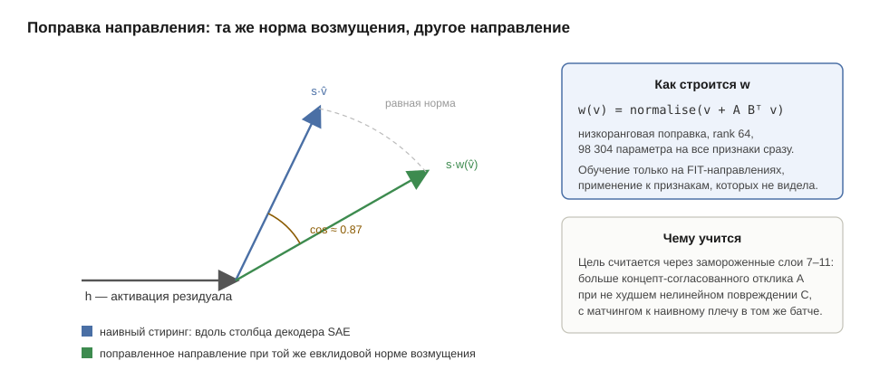

# Repairing SAE feature steering in GPT-2 small: a denoiser erases the signal, a learned direction correction delivers more concept, and its perplexity gain is largely a confidence artifact

T-Lab 2026, Mechanistic Interpretability track (rounds 1 to 3), with a follow-up round added after
submission (round 4). Code and reproduction commands: [`README.md`](README.md). Preregistration:
[`PLAN.md`](PLAN.md). Published artifacts (the direction correction `dir_hot`, its entropy-penalized
variant `dir_ent`, the denoiser, a model card): [`artifacts/`](artifacts/). Russian version:
[`REPORT.ru.md`](REPORT.ru.md).

**Setup.** GPT-2 small, intervention at `blocks.6.hook_resid_post`, directions from the
`gpt2-small-res-jb` SAE, strength in units of each feature's natural activation ceiling, fluency
proxied by the log-perplexity of the continuation under Pythia-410m, concept by the hit rate of the
feature's own keyword list. Features are split into FIT (training), DEV (all hyperparameters) and
TEST (opened once); two further held-out sets of 12 and 48 features were added later.

**Round one** tests the task's proposal, a denoiser applied after the intervention, and three repairs
of it. The denoiser erases 24 to 62% of the steering vector, in agreement with a closed-form
prediction, and every post-hoc repair of the activation increases the nonlinear part of the
downstream response. No arm beats naive steering (sections 2 to 8).

**Round two** learns a rank-64 correction of the injection direction (98k parameters) that keeps the
perturbation norm fixed. On TEST it raises the preregistered endpoint from 0.534 to 0.776 and, paired
at equal strength, lowers Pythia log-PPL by 1.35 nats while raising the concept metric by 0.31; a
random rotation by the same angle does neither (section 9). **Round three** replicates both gains on
12 features held out of the correction's training, and a blind audit by a single LLM annotator
confirms the concept gain but finds more degeneration and no gain in coherence (sections 9.10 to
9.10b).

**Round four** takes the correction apart. Half of what it adds, averaged over features, is one
shared direction that regulates the model's confidence: it lowers next-token entropy, collapses the
final-layer residual norm, and helps the same tokens on real text whichever feature it is attached
to. Injected on its own it lowers the generation perplexity more than the full correction does at
strengths up to `c = 2`, with no concept delivered, and makes the model predict real text worse.
Pythia log-PPL of generated text is therefore not a fluency measure in this setting, and the round-2
and round-3 controls could not have caught that. What survives is measured on text the model did not
write. At matched concept delivery the learned correction damages real-text prediction less than
naive steering, by 0.07 to 0.6 nats depending on how the two curves are joined, with wide intervals
and only four features on the capability side. The concept gain replicates on 48 fresh features and,
smaller and feature-dependent, on a second layer, and a correction trained with an entropy penalty
reduces the mean shared component and keeps the sign of the real-text comparison (section 10).

---

## 1. Problem setup

Steering along a direction `v` from the SAE decoder amplifies a desired property of the model:

```
h̃ = h + α v,   h ∈ R^768,   v = W_dec[f]
```

At large `α` the property appears, but the text breaks down. The task proposes training a denoiser on
activations and applying it after the intervention: `h̃ = denoiser(h + αv)`. The formulation is given in the task
as an example, and the work is organized around it in three steps: the literal construction has two
defects; the defects are measured; and three ways around them are tested, two of which require no
training at all.

The intervention is placed at `blocks.6.hook_resid_post` — after the middle layer, as fixed in the
task. This tensor is bitwise identical to `blocks.7.hook_resid_pre` (the equality is checked by
`assert torch.equal(...)` in `activations.py verify`), on which the SAEs of the `gpt2-small-res-jb`
release were trained, so the feature dictionary lies exactly in the basis of the intervention and no
transfer between layers is required.

Intervention strength is everywhere expressed through the increment of the concept coordinate,
`s = c · natural_s(f)`, where `natural_s(f) = ceiling_f · ‖W_dec[f]‖` is the feature's own natural corpus
activation ceiling, converted into residual units (`src/common.py`, function `natural_strength`). The decoder rows
of this release have unit norm, so `natural_s` is practically equal to the feature's ceiling, and
`c = 1` means that the intervention injects as much as the feature shows at its strongest
natural firing.

The unit is tied to the feature because natural feature scales differ several-fold: per
[`results/feature_scales.csv`](results/feature_scales.csv), `natural_s` lies in the range
11.12 to 70.60 (a factor of 6.3), and a common unit `median‖h‖ = 88.23` (over 1.512M corpus activations,
`data/act_stats.json`) would hide this difference: for one feature it gives a perturbation eight times above
its own range, for another a quarter above. In units of the median norm the actual strengths are
therefore smaller than nominal: the `natural_c_in_hnorm` column gives 0.126 to 0.800, that is, from 1.25 to 7.94
times (2.6 on average across features). The `c` grid in this parameterization is comparable across features, and
methods are compared at equal concept strength, without reference to raw `α`.

An early version of the protocol set the unit by the overall residual norm (`s = c · median‖h‖`). On that scale
the predictions of section 5 and the pilot measurement in section 7.4 are recorded; the switch to the natural scale and its
consequences are discussed there as well. The quantity `median‖h‖` continues to be used where the residual is concerned:
as the scale of the denoiser's training noise and as the `σ` of the Wiener arm (section 7.1).

## 2. Two defects of the literal formulation

**Defect A: two errors are mixed.** The correction `D(x) − x` with `x = h + αv` contains both the response to
steering and the ordinary reconstruction error `D(h) − h`, which has nothing to do with steering.
Practical consequence: at `α = 0` the method `D(h)` already shifts the clean activation, i.e. the zero
point of the Pareto front depends on which `v` we intend to apply. The check in `test_arms.py`
shows this directly: the literal arm is not the identity at zero strength.

**Defect B: incorrect measurement of erasure.** The quantity `−⟨D(x) − x, v̂⟩/α` is undefined at `α = 0` and is
contaminated by defect A. The correct paired estimate of steering transmission:

```
τ(α) = ⟨D(h + αv) − D(h), v⟩ / (α‖v‖²),      erasure = 1 − τ
```

Both defects are cured by subtracting the baseline `D(h)`. Hence the method in section 3.1.

## 3. Methods

Below, `x = h + s·v̂`, `P = v̂v̂ᵀ`, `P⊥ = I − P`.

### 3.1 CDS — contrastive direction-preserving correction

```
Δ_steer = D(h + s·v̂) − D(h) − s·v̂
h̃       = h + s·v̂ + λ · P⊥ · Δ_steer
```

Two properties make the construction defensible. At `s = 0` the result equals `h` identically, for any
`λ` and `v` — defect A is removed by construction. The concept coordinate `v̂ᵀh̃` coincides with naive
steering, so the comparison is made at equal concept strength in that coordinate. The cost is two
passes of a small MLP per token and one dot product, with none of the ODE steps that GLP requires.

### 3.2 MTS — Mahalanobis transport of steering, requires no training

For a given increment of the concept coordinate, the shift of minimal Mahalanobis norm solves
`min δᵀΣ⁻¹δ` subject to `v̂ᵀδ = s`:

```
δ = s · Σ_γ v̂ / (v̂ᵀ Σ_γ v̂),     Σ_γ = (1−γ)Σ̂ + γ·(tr Σ̂/d)·I
```

The shrinkage `γ` is needed because the tail of the spectrum of `Σ̂` over 1.5M tokens is noisy, and `Σ̂` itself
is degenerate: TransformerLens centers the writing weights, so the residual lies in a subspace of dimension 767,
and the smallest eigenvalue is `3.4·10⁻¹²`.

MTS is at once a method and — in the linear-Gaussian approximation — the limit CDS approaches at
large `λ`: if the denoiser is linear and optimal, `Δ_steer` is collinear with the `Σ⁻¹` geometry, and full
compensation of the perpendicular part yields the Mahalanobis-minimal shift. This is a heuristic argument; for a
trained MLP it does not follow and is checked empirically, and section 6.2 shows that both arms
do behave similarly and both lose to naive steering. The line of work is a single one: the task's hint
→ Wiener denoiser → CDS → closed form.

### 3.3 Norm preservation — the simplest arm, requires no training

```
h̃ = ‖h‖ · normalize(h + s·v̂)
```

The hypothesis behind it is simple: the text breaks down because the intervention takes the residual norm outside
its usual range, and it is enough to put the norm back. The arm does not change the direction of the result and
therefore serves as a lower bound on complexity: if the problem is only the norm, everything else in section 3 is
superfluous.

### 3.4 The denoiser: architecture and noising scheme

The task separately asks to think about two things — how to noise during training and which architecture. Both
were chosen on DEV among the variants actually trained:

| variant | parameters | noising | NRMSE at `c = 1` | at `c = 3` |
|---|---|---|---|---|
| `linear_mix_cond0_s0` | 0.59M | mixture `t·h + (1−t)ε` | 0.585 | 1.116 |
| `mlp_mix_cond0_s0` | 2.36M | mixture, without conditioning | 0.671 | 2.404 |
| `mlp_mix_cond1_s0` | 2.36M | mixture, conditioned on strength | 0.587 | 0.820 |
| **`mlp_gauss_cond1_s0`** | 2.36M | additive Gaussian noise `h + σε` | **0.659** | **1.186** |
| `mlp_fixed200` | 2.36M | fixed noise strength | 1.117 | 1.297 |

The architecture is an MLP of 768 → 1536 → 768 with GELU and a residual connection (2.36M parameters);
conditioning on the perturbation strength is fed in through a projection of the scalar into the hidden dimension
(a FiLM-like layer was tried and gave no gain). Training takes 5 minutes on a 1660 Ti; perturbations are
synthesized only from `FIT` directions.

The table shows that conditioning on perturbation strength matters more than either the architecture or the
noising scheme. Without it (`cond0`), NRMSE at `c = 3` grows threefold, because the model sees the same
input at different strengths and averages. The mixture scheme `t·h + (1−t)ε` is slightly better than the additive one at large
strengths (0.820 versus 1.186); at the working strength `c = 1` they are comparable (0.587 versus 0.659); and on DEV
the additive one won on the final metric — it is the one frozen in `configs/frozen.yaml`. The linear denoiser,
four times smaller, is no worse than the MLP at `c = 1`: the reconstruction problem here is mostly linear, and that
by itself explains why the whole family of denoiser-based arms gives no gain.

### 3.5 FSR — feature surgery, requires no training

```
z    = enc(x)
z'_j = min(z_j, k·ceiling_j)   for all j outside {target feature ∪ buffer |cos| ≥ 0.3}
h̃    = dec(z') + (x − dec(z))
```

`ceiling_j` is the maximum activation of feature `j` on the corpus (computed over all 24576 latents,
`sae_stats.py`; median maximum 30.85; the number of features that never activated on the corpus is 6,
not to be confused with the 109 that fell outside the frequency band of the selection in section 4). The term `x − dec(z)` is
a pass-through of the reconstruction error, thanks to which the arm is the identity at `s = 0` and the SAE's own
error does not enter the comparison.

The substantive difference from the geometric arms: FSR answers the question "what exactly is broken", while
the others answer "where the breakage is". The list of the most clampable features is a named
mechanism at the level of interpretable units.

### 3.6 CTR — declared as a stretch component, not run

The idea: train the repair against frozen layers 7 to 11 instead of activation MSE, which remains a proxy —
preserve the part of the logit response that agrees with weak, still-fluent steering, and
suppress the nonlinear residual. Formally this is a KL between the response at the working strength and the linearly
extrapolated response at low strength, plus a constraint of identity at zero strength.

The arm was not run, and the decision to drop it follows from section 7.5: any post-processing of the activation
increases damage several-fold, and CTR is post-processing. The one way it differs from the
others is that it optimizes the logit response instead of the activation, i.e. it is the only place where
section 7.5 could be wrong. That is what makes it a candidate for follow-up work; see section 8.

## 4. Protocol

**Features.** Selection by an objective rule: a feature passes if 80% of the mass of its top-256
activations carries between 3 and 25 distinct tokens and at least 70% of that mass falls on content
words (not function words, not punctuation, length ≥ 4). Of 24576 latents, 24467 are alive, 4912
pass the rule; from these, with a fixed seed and a pairwise `|cos| < 0.3` requirement, 12 TEST and
6 DEV features were selected. The features' token sets automatically become the keywords for the
model-free metric.

**Split and freezing.** `FIT` (24000 features) is used only to synthesize training perturbations,
`DEV` (6) to choose all hyperparameters, `TEST` (12) is opened once. Any feature with `|cos| ≥ 0.3`
to `DEV ∪ TEST` is excluded from `FIT`; the actual maximum over all pairs is 0.2997
([`results/leakage.csv`](results/leakage.csv)). All inference hyperparameters (knobs) are frozen on
DEV and written to `configs/frozen.yaml` before the first TEST run; on TEST only `c` changes. This
matters: the `λ` sweep contains `λ = 0`, that is the baseline itself, so a front built as the union
of points over `(c, λ)` would dominate the baseline tautologically.



**There is no prompt split of the kind declared in the preregistration.** `PLAN.md` requires ten DEV
prompts and thirty TEST prompts from different documents. In fact both `src/sweep_dev.py` and
`src/generate.py` take prompts from the beginning of the same file `data/prompts.json` (the first
ten and the first thirty respectively), so all DEV prompts are contained in TEST. A third of the
TEST prompts were visible while the inference hyperparameters were being chosen. The features are
split, the prompts are shared, and this weakens the claimed independence of TEST: part of the
evaluation's text budget already took part in tuning.

**Fairness to the baseline.** The task's literal formulation gets its own best denoiser and its own
correction strength, selected on DEV independently of what won for the contrastive arm. Otherwise
the baseline would be artificially weakened by our own choice, and any comparison would lose its
meaning. Both values are stored in `configs/frozen.yaml` as separate fields.

**One training seed.** `PLAN.md` promised two training seeds for the denoiser and for the arm
trained against downstream. Two seeds exist only for the mixture variant `mlp_mix_cond1_s0/s1`,
which was not chosen in the end. The frozen denoiser `mlp_gauss_cond1_s0` and the direction
correction `dir_hot` have one seed each, and the arm against downstream was never run at all (section 3.6).
All intervals in the report come from a bootstrap over features and prompts and do not cover the
spread due to training noise: the robustness of the result to retraining the model with a different
seed has not been measured.

**Metrics.** The automatic fluency proxy is the log-perplexity of the continuation under an
independent model (Pythia-410m), computed only over the generated tokens conditioned on the prompt.
GPT-2's own perplexity on its own generations is degenerate: a broken model is confident in its own
output. The report also uses dist-1/2/3 following Li et al. 2016 (corpus level, normalized by the
number of tokens, fixed generation length), the repeated 4-gram fraction, and prompt dependence: the
difference in log-PPL between shuffled and true prompts, which catches the regime where steering
made the model forget the prompt.

A low Pythia log-PPL is only an automatic indicator of text predictability; it is not a synonym for
fluency: cyclic repetitions are predictable too. That is why the conclusion is additionally compared
against a blind LLM annotation (section 9.10b), and no claim about human-judged quality is made from PPL
alone.

The concept axis is the keyword hit rate over the automatically derived token set, excluding words
already present in the prompt (primary, with no model in the loop), and the activation of the target
feature when the generated text is passed through the SAE again (secondary; the circularity is
acknowledged).

**What from the original metric-validation plan was not done.** `PLAN.md` declared a third concept
metric — a Qwen2.5-1.5B-Instruct LLM judge — and gated its admission on agreement with manual
annotation of about a hundred texts. It also declared a blind manual annotation of about 150 texts
as a check on both axes. The judge was never run, and there is no human annotation. After the
experiment was finished, a single LLM annotator in a separate context rated 468 saved round-3
generations against a rubric fixed locally before annotation. Method names were hidden and the
sample was built deterministically (section 9.10b,
[`evaluation/ai_annotation/`](evaluation/ai_annotation/)). This is an additional qualitative check.
There is no second annotator and no estimate of agreement between independent annotators.

The consequence: two automatic concept metrics and the LLM criterion `target_success` take their
target vocabulary from the same SAE. Their agreement is therefore weaker than agreement between
independent sources, and it cannot serve as an argument that "two independent concept metrics
converge". The more external parts of the LLM annotation are coherence and prompt relevance, but they
too remain the judgment of a single model.

**Primary endpoint**, declared in advance: the keyword hit rate interpolated to a log-PPL budget
equal to the log-PPL of naive steering at `c = 1.0` for the same feature. The attainable frontier is
built as the running maximum of the concept over increasing log-PPL: at budget `B` any point with
`log-PPL ≤ B` is available, since a lower strength can always be chosen. If an arm's front lies
entirely to the left of the budget, the arm is credited with its best concept — this is part of the
definition and is symmetric across all arms. The confidence interval is a paired hierarchical
bootstrap that resamples features and prompts and recomputes the front in each replicate; for the
comparison with the baseline, the difference itself is bootstrapped. The front machinery is checked
on synthetic data (`test_pareto.py`): with identical arms no significance is claimed, and with a
planted effect it is detected.

**Secondary budgets** are additionally declared — the same quantities at budgets equal to the
log-PPL of naive steering at `c = 1.5` and `c = 2.0`. The reason: the primary budget `c = 1.0` is
fairly tight, and the concept for naive steering reaches its maximum above it, so it is useful to
repeat the comparison where the baseline actually works. The primary budget remains `c = 1.0`, as
written down before TEST was opened; the secondary budgets were also declared before TEST was opened
and serve as a robustness check on the conclusion.

## 5. Predictions recorded before the TEST runs

The predictions were fixed in the preregistration before TEST was opened. The numbers in them are
forecasts; their comparison with the results is collected in section 6.4.

**P1. Erasure is present, but it is conditional.** For the Wiener denoiser the transmission equals
`τ = 1 − σ²·v̂ᵀ(Σ+σ²I)⁻¹v̂`, that is, for an eigendirection with variance `s` this gives
`τ = s/(s+σ²)`. For the 12 selected TEST features the variance along the direction lies in the range
10.4 to 23.2 against a mean per-coordinate variance of 5.8, that is, these are directions with
above-typical variance. For a perturbation of total norm `c·88.2` the equivalent per-coordinate
variance is `(c·88.2)²/768`, which at `c = 1` gives 10.1. Hence the prediction: `τ ≈ 0.5 to 0.7` at
`c = 1` and less at larger `c`. (The arithmetic is written in the preregistration strength scale,
where the unit was the total residual norm; the runs use the natural feature scale, see section 2, so `c`
here and `c` in section 6 are different units. The mean per-coordinate variance 5.8 is
`tr Σ/768 = 4476.7/768`, `data/act_stats.json`; the range 10.4 to 23.2 over the 12 TEST features is the
`var_along` column in `results/feature_stats.csv`.) The trained MLP may deviate from the formula,
because for it large `c` is extrapolation, and this is exactly what the arm with a fixed training
strength tests.

**P2. The naive denoiser will not shift the front.** I expect the `denoise_naive` front to be within
noise of the `naive` front, because it lowers both the damage and the concept roughly
proportionally.

**P3. CDS will give +10 to 30% on the primary endpoint** relative to naive steering. I do not expect
degeneracy: for all 12 TEST features the tilt `κ_tilt = ‖P⊥Σv̂‖/(v̂ᵀΣv̂)` lies in the range
1.55 to 2.17, that is, far from the zero at which CDS would algebraically coincide with naive steering
at a retuned strength. A direct illustration: for the direction checked in `test_arms.py`, the
cosine between `Σv̂/(v̂ᵀΣv̂)` and `v̂` equals 0.42 — the transport changes the direction, not only
the scale.

**P4. MTS will take at least half of the CDS gain.** If so, the conclusion of the work is stronger:
the main part of the repair is linear and comes for free.

**P5. The damage is sparse and mediated by features.** A preliminary measurement in the old strength
scale gave about 7.8 non-target latents per token under clamping at `c = 3` (the figure survives
only in the text of the preregistration). Prediction: the FSR gain correlates with the number of
such latents, not with the total norm of the perturbation.

**P6. The gain falls as the variance along the direction grows.** I expect a positive rank
correlation of the gain with `κ_tilt` and a negative one with `v̂ᵀΣv̂`, |ρ_s| > 0.5 on 12 features.

**P7. CTR will beat CDS, but by no more than a factor of 1.5.** Training against downstream
optimizes what we care about, but runs into the same geometry.

### 5.1 What will be done if the predictions are not confirmed

Recorded before looking at the DEV numbers, because otherwise this decision is already made under
the influence of the result.

If no arm shifts the front on DEV, the order of work does not change: the knobs are frozen anyway,
TEST is run once, and the negative result goes into the report together with the mechanism that
explains it — the measurement of transmission `τ`, the spectral decomposition and the per-feature
breakdown. The work remains complete: it answers the question "does the construction proposed in the
task reduce the negative effect of steering" with a number and an explanation, regardless of the
sign of the result.

What will not happen in that case: picking a new idea on the same DEV features until a positive
result is obtained. Any new method requires a separate DEV pass and is declared in the report as a
second round, stating that it was chosen after seeing the first. Otherwise DEV turns into a hidden
test, and the claimed significance stops meaning anything.

## 6. Results

One pass over 12 TEST features, 8 strength values, 30 prompts, 17640 continuations. The inference
hyperparameters are taken from `configs/frozen.yaml`, which was written before generation.

### 6.1 The literal formulation of the task damages text when steering is off

Identity check at `c = 0`: all arms use the same sampling seed, so at zero strength their
continuations must match the no-steering continuations byte for byte.

| arm | share of continuations matching "no steering" |
|---|---|
| naive steering, norm-preserving, CDS, MTS, FSR | 1.000 |
| **the task's literal denoiser arm** | **0.033** |

The construction `D(h + αv)` changes 97% of the continuations even when there is no steering. This
is defect A from section 2, measured on real generations: the zero point of the front for this arm depends
on which `v` we were about to apply. The contrastive form removes the defect by construction, which
is what the row above confirms.

### 6.2 Primary endpoint: no arm beats naive steering

Concept at a Pythia log-PPL budget equal to that of naive steering at `c = 1`. Paired hierarchical
bootstrap, 2000 replicates, interval on the difference. Round-1 result files carry the `r1_` prefix,
round-3 files `r3_`, round-2 files no prefix.

| arm | endpoint | Δ vs naive | 95% interval | share of bootstrap replicates with Δ > 0 |
|---|---|---|---|---|
| naive steering | 0.534 | 0 | — | — |
| FSR, feature surgery | 0.527 | −0.008 | [−0.049, +0.077] | 0.63 |
| the task's literal denoiser arm | 0.437 | −0.097 | [−0.252, +0.037] | 0.10 |
| CDS, contrastive correction | 0.403 | −0.132 | [−0.257, −0.023] | 0.008 |
| norm preservation | 0.379 | −0.156 | [−0.274, −0.025] | 0.004 |
| MTS, Mahalanobis transport | 0.185 | **−0.349** | [−0.515, −0.177] | 0.000 |
| no steering (metric floor) | 0.086 | −0.448 | [−0.637, −0.281] | 0.000 |

The Δ column is the point paired difference, that is, exactly the difference of the endpoint
column: `concept_at_budget` is defined for all 12 features in all arms, so both columns are
computed on the same support and the subtraction is consistent. The interval and the share of
positive replicates come from the paired hierarchical bootstrap, whose center for a nonlinear
statistic (the front is rebuilt inside each replicate) need not coincide with the point estimate,
so the interval around it is asymmetric.

The only significant effects are negative. At the secondary budgets declared before TEST was
opened, the picture is the same: at `c = 1.5` the contrastive arm gives −0.056 with interval
[−0.159, +0.066] and a share of positive bootstrap replicates of 0.17; at `c = 2.0`, −0.060 with
the same share of 0.17. FSR is at zero at both budgets (+0.018 and +0.003); MTS is significantly
negative at 1.5 (−0.268, interval [−0.470, −0.054]).

A more powerful paired test at equal strength (section 9.6) sharpens these conclusions and makes them
significant: at equal strength the task's literal formulation raises Pythia log-PPL by 0.43 nats with
interval [+0.06, +0.87] and no gain in concept. Norm preservation, the contrastive correction and
Mahalanobis transport significantly lose concept (−0.07, −0.10 and −0.18; the intervals do not
contain zero).

The shape of the fronts explains the numbers: the task's denoiser and the contrastive arm follow
the same curve as naive steering, only moving further to the right — that is, they slide along the
front instead of shifting it. This is exactly prediction P2, and it was confirmed. For Mahalanobis
transport the whole front is shifted to the right, which is consistent with its fourfold
perturbation energy from section 7.4.


### 6.3 Validity of the axes

The two concept metrics agree: the rank correlation of the keyword hit rate with the activation of
the target SAE feature is **0.83** (`n = 684` cells, `p ≈ 2·10⁻¹⁷³`,
[`results/metric_agreement.csv`](results/metric_agreement.csv)). The metrics are built differently —
one is lexical with no model in the loop, the other reads the activation of the same feature — but
they are not independent: the dictionary for the first is derived from the top activations of the
same SAE from which the direction is taken and from which the second is read. Their agreement
therefore shows that the lexical proxy has not drifted away from the activation; it does not
replace the independent human validation that was planned but not carried out (section 4). The post-hoc
annotation by a single LLM annotator (section 9.10b) adds an external linguistic sanity check: it confirms
stronger delivery of the target concept, but shows no clear win in coherence or overall quality and
finds more degeneration in the correction arm. This directly contradicts the convenient reading of
Pythia log-PPL as "fluency".

Both axes are non-monotonic in strength. Log-perplexity rises steeply up to `c ≈ 1.5`
(3.43 → 5.51 pooled over arms), and then falls slightly — to 5.18 at `c = 3`: by that point the
text has degenerated into repetition, and repetition is predictable. Concept rises up to
`c ≈ 1.0 to 1.5` (maximum 0.388 at `c = 1`) and then falls, because there is nothing left in destroyed
text with which to express the concept. The guard metric behaves unambiguously here: prompt
dependence falls from 0.62 at `c = 0` to 0.01 to 0.18 at `c = 3` depending on the arm, that is, under
strong steering the model stops reading the prompt.

The non-monotonicity of both axes is exactly the reason the attainable frontier is built as a
running maximum: otherwise the "front" would contain points dominated by a weaker strength of the
same arm.

The diversity metrics declared in section 4, over TEST features, averaged across features:

| `c` | naive dist-1 / 2 / 3 | correction dist-1 / 2 / 3 |
|---|---|---|
| 0.0 | 0.617 / 0.911 / 0.923 | 0.617 / 0.911 / 0.923 |
| 1.0 | **0.565** / **0.890** / **0.911** | 0.530 / 0.830 / 0.855 |
| 2.0 | **0.414** / **0.704** / **0.750** | 0.291 / 0.521 / 0.599 |
| 3.0 | **0.338** / **0.608** / **0.680** | 0.225 / 0.388 / 0.461 |

This measurement goes against the method: the correction has lower diversity than naive steering at
every strength from `c = 1` on, and the gap grows with strength — dist-1 at `c = 1` is 0.530
against 0.565, at `c = 3` already 0.225 against 0.338, that is, one and a half times lower. The
gain in perplexity and in concept comes with a loss in lexical diversity, and at high strengths the
loss is large.

An explanation consistent with the other measurements: the correction delivers more concept
(section 9.6, section 9.9), and the more the text is concentrated around the feature's topic, the fewer distinct
n-grams it contains. That is, diversity here partly measures the strength of concept delivery. The
interpretation does not cancel the numbers: judged by the dist metrics the method loses, and the
claim of this work rests on perplexity under an independent model and on the keyword hit rate for
the feature's dictionary. Round four shows that the perplexity half of that basis is not a fluency
measure once the injected direction changes the model's confidence (section 10.4); the concept half
stands.


### 6.4 Predictions against results

| # | Prediction | Outcome |
|---|---|---|
| P1 | Erasure is present and depends on `σ` and on the position of `v̂` in the spectrum; `τ ≈ 0.5 to 0.7` at `c = 1` | **Confirmed**: `τ = 0.655` at `c = 1`, from 0.76 down to 0.38 across the grid; for the Wiener arm the closed form matches the measurement to the fourth decimal place for every feature with no free quantities (section 7.1, `src/closed_form_check.py`) |
| P2 | The naive denoiser will not shift the front | **Confirmed**: Δ = −0.097, the interval contains zero |
| P3 | The contrastive correction will give +10 to 30% | **Refuted**: Δ = −0.132, the interval does not contain zero |
| P4 | Mahalanobis transport will take ≥50% of the gain | **Refuted**: the worst arm, Δ = −0.349 |
| P5 | The damage is sparse and is carried by captured features | **Refuted**: at `c = 1`, 0.0024 non-target latents per token cross the ceiling |
| P6 | The gain falls with the variance along `v̂` and grows with `κ_tilt` | **Not confirmed on an insufficient sample**: the correlation was computed, the sign was guessed correctly, the threshold was not met — see below |
| P7 | The learned against-downstream repair will beat the contrastive one | **Not done**: the arm was never run, see section 8 |

P6 was tested, not skipped. `PLAN.md` (H5) predicted a positive rank correlation of the gain with
`κ_tilt` at `|ρ_s| > 0.5` over 12 features. It was computed:
[`results/predictors.csv`](results/predictors.csv) gives `ρ = +0.476` at `p = 0.233` and
`n = 8` for the contrastive arm. The sign matched the prediction, the magnitude fell short of the
declared threshold of 0.5, there is no significance. The correlation uses eight features, because
the per-feature gain is not defined for all of them, and on eight points such a test can show
almost nothing: `p` for the other arms and predictors lies between 0.21 and 0.91. The outcome is
"not confirmed on a sample insufficient for the test".

Three predictions out of seven (P3, P4, P5) are refuted outright, one more (P6) was not confirmed,
one (P7) was not tested. Section 7 works through the discrepancies.

## 7. Mechanism analysis

The measurements below do not depend on the TEST outcomes: none of them looks at the generated text
and none of them took part in choosing hyperparameters. Some of them use the geometry of the
TEST directions — the covariance of activations along `v̂`, spectral position, cosines — and this is
not outcome leakage: the geometry of a direction is a property of the feature itself in the frozen
model, known before any generation. Where a measurement was made on DEV only, this is stated in the
corresponding subsection.

These measurements are the substantive part of the work: they explain why the construction from the
task does not work and why three natural ways to repair it do not work either.

### 7.1 The denoiser erases the steering signal itself (P1 confirmed quantitatively)

Transmission is measured as `τ(c) = ⟨D(h + s·v̂) − D(h), v⟩ / (s‖v‖)`, with the baseline subtracted,
so the quantity is defined at any strength and is not contaminated by the ordinary reconstruction
error. The same table gives the fraction of the correction's energy orthogonal to `v̂`, that is, the
part that the contrastive arm preserves.

| `c` | τ, trained MLP | erased | fraction of correction ⊥ `v̂` |
|---|---|---|---|
| 0.5 | 0.760 | 24% | 0.78 |
| 1.0 | 0.655 | 35% | 0.65 |
| 1.5 | 0.563 | 44% | 0.53 |
| 2.0 | 0.488 | 51% | 0.43 |
| 3.0 | 0.376 | **62%** | 0.29 |

The denoiser does not distinguish the useful part of the perturbation from the harmful one,
and together with the damage it removes from a quarter to two thirds of the signal itself, the more
so the stronger the intervention. This is why the task's literal formulation slides along the front
instead of moving it.

**The closed form predicts the measured erasure.** For the linear-Gaussian estimator
`D(x) = μ + Σ(Σ+σ²I)⁻¹(x−μ)` the transmission is

```
τ = 1 − σ² · v̂ᵀ(Σ + σ²I)⁻¹ v̂,   and for an eigendirection with variance s this is s/(s+σ²)
```

The measurement gives `τ = 0.438` constantly across all strengths — exactly what the linearity of
the operator requires, unlike the trained MLP, whose τ falls with strength.

**The exact form reproduces the measurement identically, and it contains no free quantities.** The
`wiener:1.0` arm is literally the same linear-Gaussian estimator (`src/denoiser.py`,
`WienerDenoiser`), so the measured `τ` must equal `v̂ᵀΣ(Σ+σ²I)⁻¹v̂` identically, and it does. `σ` is
not tuned: `wiener:1.0` means noise at the full norm `median‖h‖`, that is,
`σ² = 88.23²/768 = 10.136`, and `Σ` is taken from the data. The measurement was run on six DEV
directions:

| feature | measured | exact form | error | `s/(s+σ²)` | variance along `v̂` |
|---|---|---|---|---|---|
| 1171 | 0.4473 | 0.4473 | 0.0000 | 0.6051 | 15.53 |
| 8475 | 0.4280 | 0.4280 | 0.0000 | 0.5849 | 14.28 |
| 10388 | 0.4346 | 0.4346 | 0.0000 | 0.6512 | 18.93 |
| 17242 | 0.4403 | 0.4403 | 0.0000 | 0.6000 | 15.20 |
| 21592 | 0.4366 | 0.4366 | 0.0000 | 0.5206 | 11.01 |
| 24487 | 0.4422 | 0.4422 | 0.0000 | 0.5890 | 14.52 |

Mean: measured **0.4382**, predicted **0.4382**; the discrepancy is zero to the seventh digit, that
is, float32 rounding in the saved operator.

The match is exact. It is an identity, not a confirmation of theory on data: `wiener:1.0` literally
is the linear-Gaussian estimator, so `τ` must equal `v̂ᵀΣ(Σ+σ²I)⁻¹v̂` algebraically, for any data.
The check here works as an implementation control — it catches a divergence between what the code
does and what the formula states, including a mismatch in covariance shrinkage between scripts.

**The scalar simplification breaks, and this is a result, not a defect of the theory.** The
right-hand side of the formula, `s/(s+σ²)`, is correct only for an eigendirection of `Σ`, and the
SAE decoder columns are not eigendirections: over the same six directions
`cos(Σv̂, v̂) = 0.43 to 0.59` (section 7.3 measures this independently and gives the same order). The
simplification gives a mean of 0.592 against the measured 0.438, with an error of up to 0.217 — and
it errs in one direction for an algebraic reason: `λ/(λ+σ²)` is concave, so by Jensen's inequality
substituting a single "average" variance instead of averaging over the spectrum overestimates `τ`
(the values are taken from
[`results/closed_form_wiener_1.0.csv`](results/closed_form_wiener_1.0.csv)). The mismatch of the
simplification measures the non-Gaussian geometry of `Σ` along the decoder directions.

The numbers in the table are not entered by hand: `src/closed_form_check.py` recomputes them from
`results/transmission.csv` and the corpus covariance, and fails if the match disappears or if the
simplification stops erring in one direction.

The same data show where the work of the Wiener correction goes: only a tenth of it is orthogonal
to `v̂`, that is, 90% of the linear denoiser's effort is fighting the steering, not repair.


### 7.2 The orthogonal part of the correction is not repair (P3 refuted)

Section 7.1 implied that it is enough to discard the component along `v̂` and keep the orthogonal
one. The check refutes this: the contrastive arm loses to naive steering at matched log-PPL. At
`c = 1` the orthogonal part carries 65% of the correction's energy, that is, a quantity comparable
to the perturbation itself is added — and it raises log-PPL without buying the concept.

The correct conclusion: the denoiser's correction is erasure plus noise. There is no useful orthogonal component in it that could be separated out and kept.
This also explains why the task's literal formulation does not lose by much: its only real effect
is an equivalent reduction of the steering strength.

### 7.3 Mahalanobis transport minimizes the wrong norm (P4 refuted, with a mechanism)

The shift of minimal Mahalanobis norm at a given increment of the concept coordinate is
`δ = s·Σv̂/(v̂ᵀΣv̂)`. Its Euclidean norm is related to the naive one by the exact relation

```
‖δ‖ / s = 1 / cos(Σv̂, v̂)
```

Measurement over the 18 selected features: the cosine lies in the range 0.42 to 0.59, so the ratio of
norms is **1.71 to 2.38**. At an equal concept coordinate this method injects twice as large a
perturbation into the model.

| feature | variance along `v̂` | `κ_tilt` | `‖δ‖/s` | `cos(Σv̂, v̂)` |
|---|---|---|---|---|
| 5843 | 14.39 | 2.17 | 2.38 | 0.421 |
| 23860 | 23.17 | 2.01 | 2.24 | 0.446 |
| 14434 | 13.46 | 1.97 | 2.20 | 0.455 |
| 7998 | 13.13 | 1.55 | 1.84 | 0.545 |
| 21592 | 11.28 | 1.39 | 1.71 | 0.586 |

Fluency is broken by the size of the perturbation in the Euclidean metric — the same quantity that
determines the statistics seen by the LayerNorm of the next block. Minimizing the Mahalanobis norm
therefore optimizes the wrong functional and pays double the price for the same concept. This is
the reason for the worst result among all arms.

This implies a concrete direction that this work deliberately does not test, so as not to tune the
method on the same features: match the Euclidean norm of the perturbation instead of the concept
coordinate, that is, `δ = s·Σv̂/‖Σv̂‖`. That is a different method, and it requires a separate DEV
pass with an explicitly declared new round.

### 7.4 The damage is not where it was looked for

Two premises on which three of the four arms rested are refuted by measurement.

**The premise "the damage lives in low-variance directions".** The energy of the perturbation at
`c = 1` and its fraction in the low-variance half of the covariance eigenbasis:

| arm | total energy | fraction in the low-variance half |
|---|---|---|
| naive steering | 1778 | 0.164 |
| the task's denoiser | 1118 (0.63×) | 0.211 |
| CDS | 2264 (1.27×) | 0.168 |
| MTS | 7116 (**4.0×**) | **0.0014** |

By construction Mahalanobis transport puts almost no energy into low-variance directions — 0.14%
against 16% for naive — that is, it is maximally "on-manifold" in the covariance sense. And it is
the worst of all. So the rise in log-PPL is not explained by energy in low-variance directions: the
arm that minimizes exactly this quantity loses the most. The task's denoiser also reduces the total
energy by a factor of 1.6 (this is the erasure), but raises the fraction of "bad" energy.

**The premise "the damage is carried by a small set of hijacked features".** The number of
non-target SAE latents exceeding their natural corpus ceiling:

| `c` | latents above the ceiling per token |
|---|---|
| 0.5 | 0.0012 |
| 1.0 | 0.0024 |
| 2.0 | 0.0108 |
| 3.0 | 0.0375 |

At working strengths this is one latent per several hundred tokens. There are no hijacked features
to clamp — and this directly explains why feature surgery gives a tie: it does almost nothing.

An early pilot measurement gave 7.8 latents per token. It was made in the previous strength scale,
where the unit was set by the overall residual norm instead of the feature's natural scale.
According to `results/feature_scales.csv` such a unit is inflated by a factor of 1.25 to 7.94
depending on the feature (2.6 on average across features), so "seven times" is an extreme case, and
the old pilot number refers to the most sensitive features. After calibration to the natural scale
the effect disappears — a clear illustration of how much the conclusions here depend on the
parameterization of strength.

### 7.5 A general explanation: post-processing the activation increases damage

Decomposition of the final-logit response into a component along the low-signal causal direction
of the concept (`A`) and the relative magnitude of the nonlinear residual (`C`), at `c = 1`:

| arm | `A` | `C` |
|---|---|---|
| naive steering | 39.0 | 0.55 |
| norm preservation | 39.2 | **0.50** |
| the task's denoiser | 31.7 | 0.90 |
| CDS | 44.8 | 2.04 |
| MTS | 34.8 | **9.52** |
| direction correction (round 2) | 38.1 | 0.57 |

The table is [`results/causal_AC_summary.csv`](results/causal_AC_summary.csv) (a summary over arms
and strengths; the per-item rows are in [`results/causal_AC.csv`](results/causal_AC.csv)). It is
computed by the command `python analysis.py causal --lam 1.5 --shrink 0.01`: the values of `lam`
and `shrink` are taken from `configs/frozen.yaml`, so that the `CDS` and `MTS` arms here are the
same as in generation. The script's defaults (`lam = 1.0`, `shrink = 0.05`) give a different `MTS`
and are not used in the report.

Among the round-1 arms the minimum of `C` is shared by two. For norm preservation `C` is below
naive at four strengths out of five (0.151 against 0.167 at `c = 0.5`, 0.502 against 0.547 at
`c = 1`, 1.686 against 1.712 at `c = 2`, 2.914 against 2.960 at `c = 3`). By cells (feature,
strength) the minimum among the five round-1 arms falls on it in 45 cases out of 60, against 15 for
naive.

The qualifier "among the round-1 arms" is not a formality here. If the minimum is taken over all
six rows of the table, including the direction correction, the count is different: the correction
31 cells, norm preservation 26, the naive arm 3. The distribution over strengths is sharp: at
`c = 0.5` and `c = 1` the correction wins almost nowhere (0 and 1 cell), while at `c = 1.5`, 2 and
3 it takes 10, 8 and 12 out of twelve. So the claim "the minimum damage belongs to the arms that do
not touch the activation" holds only within round 1 and only at small strengths. Round 2 removes
it, and section 9.1 is built on this. What the two leading arms have in common is that neither of
them post-processes the activation: norm preservation only rescales the result.

What holds at all strengths: any post-processing of the activation increases the damage several
times over. The task's denoiser, CDS and MTS give `C` 1.7, 3.7 and 17 times higher than naive at
`c = 1`, and this ratio is preserved over the whole grid. Norm preservation is not post-processing
in the same sense: it only rescales the result, so its parity with naive is expected and does not
undermine the claim.

There is no separate "damage" in the response lying orthogonal to the useful signal and available
for removal: the arms that try to remove it only add damage. This explains why the construction
from the task does not work and why three attempts to repair it work worse — but it does not follow
that the naive intervention is optimal, and round 2 shows this directly.

The denoiser row agrees with section 7.1 in direction but not in magnitude. It lowers `A` from 39.0
to 31.7 ([`results/causal_AC_summary.csv`](results/causal_AC_summary.csv)), that is, to 0.81 of
naive, whereas transmission in activation space at the same strength equals 0.65
([`results/transmission.csv`](results/transmission.csv), `c = 1`). The sign agrees — the denoiser
erases part of the perturbation and the logit response falls — but the drop in the response is
weaker than the erasure in the activations. Equality is not to be expected here: `A` is measured
through the frozen upper half, which is nonlinear, so the fraction of the perturbation that
survives and the fraction of the response that survives need not coincide. The gap 0.81 against
0.65 reflects this nonlinearity; there is no disagreement between two measurements of one quantity
here.

## 8. What did not work and what was left out of scope

**Whether the model's existing MLPs can simply be fine-tuned.** The task lists this as a separate
question, and the answer is negative, for a reason visible from section 7.5. Fine-tuning the
layer-7 MLP changes the model's behavior on all inputs, not only on steered ones: the intervention
has no way to tell the layer that this particular run is the edited one. Checking this costs one
measurement that the work already contains — the arms are compared at `c = 0`, where any arm must
be the identity (`identity_at_zero.csv`), and a fine-tuned MLP does not satisfy this condition by
construction: it shifts the zero point of the front, exactly like defect A from section 2. The
second objection is quantitative: `C` grows by a factor of 1.5 to 8 for any post-processing of the
activation (section 7.5), and a fine-tuned MLP is post-processing built into the model. The third
is practical: 768 → 3072 → 768 in GPT-2 small is 4.7M parameters per layer against 98K for the
direction correction, and they have to be trained on a task where the gradient comes from text. The
direction was therefore judged the cheaper lever, and it is the one tested in section 9.

**A train/inference shift, confirmed by measurement.** The denoiser was trained on corpus
activations, while at inference it sees activations generated by an already shifted context:

| source | mean norm | mean Mahalanobis distance |
|---|---|---|
| corpus | 88.9 | 26.4 |
| rollout, `c = 0` | 89.5 | 26.6 |
| rollout, `c = 1` | 97 to 107 | 32 to 37 |
| rollout, `c = 2` | 119 to 156 | 46 to 58 |

Generation itself does not shift the distribution — the `c = 0` row matches the corpus. Steering
shifts it, and by `c = 2` the norm goes 1.76 times above the training one. So the trained repair
extrapolates at working strengths, and this is one of the reasons its orthogonal correction behaves
like noise. The fix is obvious and was not part of the plan: add rollout activations to the
training set. That changes the method and therefore requires a separately declared round.

**The arm trained against downstream (P7) was not run.** It was declared the stretch part of the
plan. After section 7.5 showed that the naive intervention already has nearly minimal damage, the
expected value of this arm dropped sharply: optimizing for "do not break the upper layers" when the
damage is already nearly minimal means fighting over the remainder. The decision was made on the
result of section 7.5.

**What was left untested and why it is not added.** The mechanism of section 7.3 implies a concrete
direction: match the Euclidean norm of the perturbation instead of the concept coordinate, that is,
`δ = s·Σv̂/‖Σv̂‖`. Section 8 implies a second: train the denoiser on a mixture of corpus and rollout
activations. Neither is tested here, because the preregistration in section 5.1 forbids tuning the
method on the same features before a positive result is obtained. Both directions are named as
material for the next round.

## 9. Round two: correcting the injection direction

This section is declared as a second round. The method was chosen after the round-1 results had been
seen, and the section 5.1 preregistration requires stating that explicitly. Round 1 stays in the report as
it is, with no retroactive rewriting.

### 9.1 Why direction

Section 7.5 shows that among the round-1 arms, naive addition `h + s·v̂` and norm preservation share the
minimum of nonlinear damage `C`, while every arm that post-processes the activation increases it
several-fold. This does not forbid improvement, and the round-2 result shows exactly that: the
direction correction is measured in the same `A`/`C` table, and at working strengths its `C` is no
higher than naive — the ratio of medians across features `C/C_naive` is 0.99 at `c = 1` and falls to
0.82 / 0.79 / 0.66 at `c` = 1.5 / 2 / 3. At the same time the text is better by 0.88 to 1.79 nats of
log-PPL (paired difference over the same features). Both quantities are derived from
[`results/causal_AC.csv`](results/causal_AC.csv) and [`results/cells.csv`](results/cells.csv) and
collected into a single table [`results/dirfix_vs_naive.csv`](results/dirfix_vs_naive.csv) by the
script `src/dirfix_vs_naive.py`, so that the claim can be checked against the file.

The numbers in section 9.3 differ from these, and the difference comes from different splits: there, six
DEV features and a separate `A`/`C` measurement (`results/dirfix_eval_dev.csv`); here, twelve TEST
features from the round-1 common `A`/`C` table. The comparison against perplexity is run on TEST,
because the paired log-PPL difference is computed there. The decisive point here is `c = 1`: the
damage is the same to within a percent, while perplexity is 0.88 nats lower. So `C` is not
monotonically related to text damage, and the minimality of `C` for the naive arm by itself forbids
nothing.

A caveat about the metric itself, since it is visible in the same table: `C` is a ratio whose
denominator is the aligned amplitude, and for the `mts` arm that denominator passes close to zero on
one feature, which makes the mean `C` diverge from the median by a factor of two (9.52 versus 4.34);
at a non-frozen `shrink = 0.05` the mean goes up to 475. For the arms compared above (`naive`,
`dirfix`, `norm_preserving`) there is no such gap — mean and median agree to within a percent — but
comparisons on `C` here and below are made on medians for exactly this reason.

What actually follows from section 7.5, and is confirmed in section 9.3, is an exchange rate, not a prohibition.
The useful part of the response is measured by the aligned amplitude `A`, the damage by the residual
`C`, and arms differ in how much `A` they buy per unit of `C`. For all post-intervention repairs the
rate is bad: `C` grows several-fold, `A` does not grow (section 7.5, table). For the direction correction
`C` stays within ±7% of naive, while `A` at `c ≥ 1.5` is 12 to 31% higher (section 9.3). The magnitudes here
are modest on both axes; what grows several-fold is the downstream concept metric (section 9.4), and these
are different things. Hence the motivation: the lever is not to reduce `C` after the intervention,
but to change the rate, and the rate is set by what exactly is injected.

What remains open: `C` is declared a measure of damage, but the correspondence between `C` and text
quality when different arms are compared is not monotonic. That is, `C` works as an exchange-rate
coordinate within an arm and does not work as a standalone quality criterion between arms. This is a
limitation of the metric.

### 9.2 Method

A shared low-rank direction correction is trained:

```
w(v) = normalize(v + A Bᵀ v),   rank 64, 98k parameters
intervention:  h̃ = h + s · w(v̂)
```

The perturbation norm matches the naive one by construction — only its direction changes. This
matters for the comparison: the method cannot win by injecting more or less.



The objective is measured through frozen layers 7 to 11 and is built as a match against the naive arm
inside the same batch:

```
L = −A/A_naive + γ · relu(C/C_naive − 1)
```

where `A` is the component of the final-logit response along the low-signal causal direction of the
concept, and `C` is the relative magnitude of the nonlinear residual. The match against the naive
arm is essential here: without it the objective degenerates, because the optimum is reached by
rotating the direction "into a harmless region", at which point the concept simply stops being
delivered. The first term penalizes such drift immediately.

The correction is trained only on FIT directions and applied to features it has not seen. By
construction FIT contains no feature with `|cos| ≥ 0.3` to any DEV or TEST direction, and for round
three twelve holdout features were additionally excluded from it, with the checkpoint trained
without them — a training pool of 23988 directions instead of 24000
([`results/retrain_dir.log`](results/retrain_dir.log)).

### 9.3 What it does in response space

Measured on held-out DEV directions, averaged over features and prompts. Source:
[`results/dirfix_eval_dev.csv`](results/dirfix_eval_dev.csv), 30 rows: six DEV features × five
strengths; checkpoint `dir_hot`, the same one used in all of sections 9.6 to 9.10, trained without the round-3
holdout.

| `c` | `A / A_naive` | `C / C_naive` |
|---|---|---|
| 0.5 | 0.90 | 2.28 |
| 1.0 | 1.00 | 1.07 |
| 1.5 | **1.12** | 0.99 |
| 2.0 | **1.23** | 1.03 |
| 2.5 | **1.31** | 1.07 |

The trade is favorable from `c = 1.5` on: the correction buys 12 to 31% more concept-aligned response
while barely touching the nonlinear residual (`C/C_naive` = 0.99 to 1.07, i.e. within parity with the
naive arm). No round-1 arm gave such a trade: there, any gain in `A` came with a several-fold growth
of `C` (section 7.5). At `c = 1.0` the gain in `A` is zero; at `c = 0.5` the trade is outright unfavorable
(`A` below naive, `C` twice as high) — this is the method's boundary of applicability, and at the
text level it shows up as the absence of a concept advantage at `c = 0.5` on TEST (section 9.6).

The spread across cells is large: `A/A_naive` on individual rows lies in 0.828 to 1.651 and
`C/C_naive` in 0.799 to 3.653; 28 of 30 rows for `A` and 30 of 30 for `C` fall more than one percent
away from unity. The means above are means over six features; on an individual feature the value can
be different.

The cosine between the corrected direction and the original one on DEV is **0.846** on average (by
feature: 0.711, 0.762, 0.876, 0.899, 0.900, 0.930); on the twelve TEST features the mean is 0.834
(section 9.8). That is, the method puts less along the SAE decoder column and at the same time activates
the same feature more strongly, raises the keyword hit rate and lowers Pythia log-PPL. Hence a
substantive conclusion that stands apart from the contested interpretation of text quality: **the
SAE decoder column is not the most effective injection direction for reproducing the downstream
effect of its own feature.** A direction found on other features and transferred to new ones wins on
the two automatic benchmark axes; the LLM annotation confirms the concept but not the fluency improvement
(section 9.10b).

### 9.4 Text level on DEV

Source: `results/scored_dev_r2.csv`; the DEV run was performed with the final checkpoint `dir_hot`.
The naive arm reproduces exactly in this run, which also confirms that the pipeline is
deterministic.

| `c` | naive: log-PPL / concept | correction: log-PPL / concept |
|---|---|---|
| 0.5 | 3.95 / 0.233 | **3.65 / 0.250** |
| 1.0 | 4.98 / 0.583 | **4.48 / 0.750** |
| 1.25 | 5.60 / 0.500 | **4.57 / 0.567** |
| 1.5 | 6.01 / 0.467 | **4.86 / 0.667** |
| 2.0 | 6.32 / 0.350 | **4.96 / 0.733** |
| 3.0 | 6.22 / 0.283 | **4.98 / 0.683** |

The correction strictly dominates at every strength in the grid on the two automatic metrics:
simultaneously lower Pythia log-perplexity and higher concept. At `c = 2` naive steering gives
concept 0.35 at log-PPL 6.32, the correction 0.73 at 4.96. The activation of the target SAE feature
agrees: 2.17 versus 0.12. Six DEV features is a small sample, no intervals are built here, and only
one conclusion was drawn from this table: the method is worth taking to TEST.

### 9.5 Specificity control

A win on both automatic axes has an obvious alternative explanation: the correction could be
shifting all directions into some "generally expressive and generally fluent" region, in which case
the concept metric would grow without any relation to the target feature. The control: every
continuation is scored twice — against its own feature's keyword list and against the lists of the
others.

| `c` | own feature | other features | specificity |
|---|---|---|---|
| 0.5 | 0.250 | 0.077 | 0.173 |
| 1.0 | **0.750** | 0.063 | **0.687** |
| 2.0 | **0.733** | **0.050** | **0.683** |
| 3.0 | 0.683 | 0.057 | 0.627 |

For comparison, naive steering reaches a maximum specificity of 0.523 at `c = 1` and falls to 0.230
at `c = 3`. For the correction it holds up: 0.51 to 0.69 at strengths from `c = 1`, and 0.60 to 0.68 at
`c ≥ 1.5` (the dip to 0.51 falls at `c = 1.25`; six features produce that much jitter). The hit rate
on other features' keyword lists does not grow with strength — 0.077 at `c = 0.5` and 0.050 to 0.067 at
strengths from 1.5 — that is, the text does not become "generally expressive", it becomes more
specifically about the target concept. The control passes.

### 9.6 Result on TEST

One pass, 12 TEST features, 8 strength values, 30 prompts, 5760 continuations. The strength grid,
the prompts and the metrics match round 1.

| `c` | naive: log-PPL / concept / SAE | correction: log-PPL / concept / SAE |
|---|---|---|
| 0.5 | 3.88 / 0.217 / 0.15 | 3.57 / 0.192 / 0.14 |
| 1.0 | 4.87 / 0.419 / 0.37 | **3.99 / 0.614 / 2.56** |
| 1.25 | 5.19 / 0.361 / 0.29 | **4.11 / 0.683 / 3.28** |
| 1.5 | 5.33 / 0.367 / 0.47 | **4.26 / 0.744 / 4.02** |
| 2.0 | 5.24 / 0.342 / 0.63 | **3.71 / 0.700 / 5.09** |
| 2.5 | 5.09 / 0.297 / 0.53 | **3.34 / 0.589 / 4.54** |
| 3.0 | 4.88 / 0.253 / 0.40 | **3.08 / 0.544 / 4.25** |

From `c = 1.0` on, the correction is simultaneously more fluent and more accurate on the concept at
every strength, and the activation of the target SAE feature is 6.9 to 11.3 times higher (median 8.6).
The DEV result reproduced on features the correction had not seen.

First the preregistered endpoint, because it was declared first. At the naive-steering budget at
`c = 1` the point endpoints are **0.776 versus 0.534**. A paired bootstrap that rebuilds the
nonlinear front inside each replicate gives a mean difference of **+0.257 with interval
[+0.145, +0.371]**, and the share of replicates with Δ > 0 is 1.0
([`results/endpoint_summary.csv`](results/endpoint_summary.csv)). The interval does not contain
zero. On the secondary budgets, declared before TEST was opened, the conclusion is the same: at
`c = 1.5` the difference is +0.210 [+0.100, +0.309], at `c = 2.0` it is +0.204 [+0.082, +0.338], and
the share of positive bootstrap replicates is 1.0 in both cases
([`results/endpoint_secondary.csv`](results/endpoint_secondary.csv)). The preregistered primary
metric therefore separates the arms on its own, without help from the paired test.

The paired test below is given alongside the endpoint, not instead of it: it is more powerful,
because in this design the arms are matched by construction — at a given `c` they inject a
perturbation of the same norm, so a comparison by cell (feature, strength) is legitimate. But it was
introduced in round 2, after round 1 had been looked at, so it remains post-hoc and is labeled
post-hoc.

**Statistics.** Paired by cell (feature, strength), bootstrap over features. The correction row comes
from [`results/paired_test_r2.csv`](results/paired_test_r2.csv), the rest from
`results/paired_r1.csv`:

| arm | Δ Pythia log-PPL | 95% | Δ concept | 95% | share of bootstrap replicates with dominance on both automatic axes |
|---|---|---|---|---|---|
| **direction correction** | **−1.35** | [−2.22, −0.53] | **+0.31** | [+0.16, +0.46] | **1.0** |
| FSR | +0.02 | [−0.01, +0.04] | +0.01 | [−0.00, +0.03] | 0.10 |
| task's literal denoiser | **+0.43** | [+0.06, +0.87] | +0.01 | [−0.12, +0.14] | 0.01 |
| norm-preserving | +0.16 | [+0.04, +0.31] | **−0.07** | [−0.15, −0.01] | 0.00 |
| CDS | +0.30 | [−0.09, +0.73] | **−0.10** | [−0.19, −0.03] | 0.00 |
| MTS | +0.61 | [−0.11, +1.22] | **−0.18** | [−0.34, −0.04] | 0.00 |

The correction dominates on both automatic axes in all bootstrap replicates over features (share
1.0), and each interval separately excludes zero: Pythia log-PPL is 1.35 nats lower, concept is 0.31
higher. This does not automatically mean better human-judged fluency (section 9.10b). The negative findings
of round 1 are also significant: the task's literal formulation, at equal strength, raises Pythia
log-PPL by 0.43 nats with an interval that does not contain zero, and gives no concept gain. For the
three remaining arms the concept drops significantly.

The paired test uses 72 cells (12 features × 6 strength values at `c ≥ 1`; weaker strengths are
dropped because the arms do not yet differ there), while the endpoint compresses two fronts into a
single number at one budget. The difference in power is visible in the interval widths; the
direction of the conclusion is the same for both metrics.

**TEST was opened twice.** The section 4 protocol declares that TEST is opened once. For round 1 this
holds. For round 2 it does not: the round-2 method was chosen after the round-1 TEST numbers had
been seen, so for round 2 TEST is not untouched. The correction did not see the TEST features — it
was trained on `FIT` and tuned on `DEV` — but the choice of the method itself was
informed by the previous round's TEST results, and this weakens the status of round 2 to
"confirmed on features that did not take part in training" instead of "confirmed on a held-out set".
A full check requires a fresh set of features; it was done and is described in section 9.10.

### 9.7 Control: random rotation by the same angle

The main alternative explanation: the gain may come from the rotation away from the decoder column
itself, independently of training the correction. The control rotates the direction by the same
angle (`cos = 0.866`) in a random direction, at the same norm.

How the random axis is built matters here: the seed is mixed with a checksum of the direction
itself (`RandomRotationArm` in `src/steering.py`), so the run is reproducible, and the controls for
different features use independent random axes instead of six rotations of one and the same
Gaussian sample.

| `c` | naive: log-PPL / concept | random rotation | correction |
|---|---|---|---|
| 1.0 | 4.98 / 0.583 | 4.95 / 0.367 | **4.48 / 0.750** |
| 1.5 | 6.01 / 0.467 | 5.87 / 0.383 | **4.86 / 0.667** |
| 2.0 | 6.32 / 0.350 | 6.18 / 0.367 | **4.96 / 0.733** |
| 3.0 | 6.22 / 0.283 | 6.26 / 0.333 | **4.98 / 0.683** |

The random rotation lies on the naive steering front and does not move it anywhere: perplexity
matches the naive arm to within 0.15 nats at all strengths; concept at `c = 1` and `c = 1.5` is
below naive (0.367 vs 0.583 and 0.383 vs 0.467), and at `c = 2` and `c = 3` it is higher by 0.02
and 0.05. The correction meanwhile is 0.47 to 1.28 nats lower in perplexity and 0.28 to 0.38 higher in
concept than the rotation.

The specificity control says the same thing, and more sharply (rotation —
[`results/control_randrot_dev.csv`](results/control_randrot_dev.csv), the other two arms —
[`results/control_specificity_dev.csv`](results/control_specificity_dev.csv)): the rotation has
specificity 0.293 / 0.337 / 0.303 / 0.280 at `c` = 1 / 1.5 / 2 / 3, naive steering has
0.523 / 0.430 / 0.307 / 0.230, the correction has 0.687 / 0.603 / 0.683 / 0.627. So the rotation is
worse than naive at small strengths, catches up with it and slightly overtakes it at large
strengths — because naive degrades — and stays two times below the correction across the whole
range.

The caveat about the angle remains: `cos = 0.866` is a fixed value matched to the mean angle. The
correction is low-rank (`w(v) = normalize(v + ABᵀv)`), so the actual angle depends on the feature:
across the six DEV features it is 0.711, 0.762, 0.876, 0.899, 0.900, 0.930, mean 0.846 (on TEST the
mean is 0.834, section 9.8). This is enough for the claim "it is not the angle as such", but not
for the claim "it is not the angle for any feature". The same control on fresh features, where the
method was not selected, is in section 9.10a. This section is kept separate because here it is
computed on DEV, that is, on the set the method itself was selected on, and in that capacity it
belongs to the selection protocol; the check is section 9.10a.

### 9.8 Control: naive steering at a matched concept coordinate

The strongest objection to the result of section 9.6 is the following. The correction injects along
`w = normalize(v + ABᵀv)` at the same norm as naive steering, but `cos(w, v̂)` is less than one —
so along `v̂` itself it puts only `cos · s`. If `v̂` is the direction along which the text breaks,
then part of the perplexity gain is explained mechanically: the correction simply pushes less hard.

The cosine is computed exactly, from the trained checkpoint, separately for each TEST feature
(`src/matched_coordinate.py`, [`results/matched_coordinate_cells.csv`](results/matched_coordinate_cells.csv)):
mean **0.834**, range from 0.667 to 0.929. So the shortfall in the concept coordinate is between 7 and
33 percent depending on the feature — a magnitude that cannot be ignored.

The control is built without a single new generation: the naive arm has a measured curve over eight
strengths, so its behavior at the intermediate strength `c' = cos · c` is read off by interpolating
its own measurements, for each feature with its own cosine. Then the same paired test over 72 cells.

| comparison | Δ log-PPL | 95% | Δ concept | 95% | share of replicates with dominance |
|---|---|---|---|---|---|
| equal perturbation norm (same `c`) | −1.349 | [−2.218, −0.529] | +0.306 | [+0.156, +0.463] | 1.0 |
| **matched concept coordinate** (naive at `cos·c`) | **−1.228** | [−2.062, −0.462] | **+0.293** | [+0.162, +0.429] | **1.0** |

The first row reproduces the headline numbers of section 9.6 exactly, which also checks the
recomputation. The second row answers the objection: when matched on the concept coordinate, the
Pythia log-PPL gain falls from 1.349 to 1.228 nats, so the mechanical explanation accounts for at
most 9% of the effect, and dominance does not change at all (1.0 vs 1.0). The concept gain also
holds, and its interval still does not cover zero.

The same result shows why the `v̂` coordinate is a poor measure of delivered concept: the correction
puts 17% less along `v̂` on average and yet produces a higher hit rate on the feature's keyword list. So
concept delivery does not reduce to the projection onto the decoder column, and this is a separate
observation that goes beyond the control.

### 9.9 Specificity control on TEST

| `c` | own feature | other features | correction specificity | naive specificity |
|---|---|---|---|---|
| 0.5 | 0.192 | 0.072 | 0.119 | **0.138** |
| 1.0 | 0.614 | 0.056 | **0.558** | 0.354 |
| 1.5 | 0.744 | 0.046 | **0.698** | 0.315 |
| 2.0 | 0.700 | 0.030 | **0.670** | 0.301 |
| 3.0 | 0.544 | 0.019 | **0.525** | 0.225 |

The correction's hit rate on other features' keyword lists falls as strength grows
(0.072 → 0.019), so the text does not simply become "expressive in general". The correction's
specificity is above the naive one at all strengths from `c = 1` upward; at `c = 0.5` naive is
ahead (0.138 vs 0.119) — that is the boundary where the advantage appears, which is why the row
with the weakest strength is included. By `c = 3` naive specificity falls from 0.354 to 0.225, that
is, by a factor of 1.6, while the correction holds at 0.525.

### 9.9a Control: repetition as an explanation of the log-PPL gain

Repetitive text is predictable, so a model that has slipped into a loop gets low perplexity while
producing worse text. The correction does repeat more than naive steering: the repeated 4-gram
fraction at `c = 3` is 0.241 vs 0.131. So the Pythia log-PPL gain, measured over all strengths at
once, could be this artifact.

The discriminating check is to compare the arms at equal repetition, not at equal strength. If the
gain is degeneration, it must disappear where both arms repeat equally.

| repeated 4-gram fraction | cells: correction / naive | Δ log-PPL | Δ concept | repetition difference |
|---|---|---|---|---|
| **exactly 0** | 1677 / 2227 | **−0.880** | +0.286 | 0.0000 |
| 0 to 5% | 129 / 43 | −0.692 | +0.395 | +0.003 |
| 5 to 15% | 191 / 41 | −0.620 | +0.493 | +0.005 |
| >15% | 523 / 209 | **+0.363** | +0.526 | −0.129 |

The narrow version of the objection is refuted. In the 1677 cells where the correction repeated not
a single 4-gram, it still gives 0.880 nats lower perplexity — there is nothing there to degenerate
by construction. And in the most degenerate cells the advantage flips sign: at a repetition
fraction above 15% the correction is 0.363 nats worse than naive. The hypothesis "the gain is
repetition" predicts exactly the opposite — that the largest gain would be where repetition is
highest.

What remains true: at large strengths the correction does degenerate more often, and part of the
gain measured over all strengths comes from that regime. The headline number should therefore be
read as an automatic-metric effect at moderate strengths; it does not claim uniform superiority in
human-judged quality. A zero repeated 4-gram fraction rules out only one narrow kind of loop and
does not rule out wider repetition, truncation, or semantic degeneration. The post-hoc LLM audit
does find more such problems for the correction (section 9.10b), so this control does not validate
fluency as a whole. The concept gain does not depend on repetition at all — it grows monotonically
with it and is present in all four bins (`src/repetition_control.py`,
`results/scored_r3_repetition_control.csv`).

Round four shows why this control is not sufficient. The learned direction carries a shared component
that lowers the model's next-token entropy; a more confident model writes text that an external scorer
finds more predictable whether or not it repeats a 4-gram, and that component injected on its own
lowers Pythia log-PPL by more than the full arm at the same strengths while delivering no concept
(section 10.4). The matched-repetition version of this control (section 10.8) is uninformative in
both directions, because the matching pins every arm, including arms indistinguishable from naive
steering, at a lower strength; the binned comparison above is the one that stands, with the caveat
that it does not address confidence.

### 9.10 Round 3: twelve directions held out of the correction's training

Rounds 1 and 2 carry a caveat: the round-2 method was chosen after the round-1 TEST numbers had
been seen, so TEST was opened twice. The only thing that repairs this is a feature set no one has
looked at.

Such a set is built as follows. `src/select_round3.py` reserves twelve features from `FIT` by the
same objective rule (they cannot be taken from outside `FIT` — the complement of `FIT` is exactly
the features that failed the `|cos| < 0.3` gate), `train_direction.py` excludes them from the
training pool, and the correction checkpoint is trained without them — 23988 directions instead of
24000 ([`results/retrain_dir.log`](results/retrain_dir.log)). The order matters here: first the
holdout selection, then training the correction, only then generation, and `scripts/run_round3.ps1`
runs the steps in exactly that order. The set is `test_r3` in `configs/features.yaml`; it does not
overlap the frozen splits and does not correlate with them (`|cos| < 0.3`, checked by assertions in
`select_round3.py`), and `test` and `dev` are untouched. The selection was committed before
generation.

The guarantee here is weaker than for `test` and `dev`. Around `test` and `dev` a buffer is set
inside `FIT`: any feature with `|cos| ≥ 0.3` to them is excluded from training. Around `test_r3`
there is no such buffer — the twelve features themselves are excluded, while their nearest cosine
neighbors remain in the training pool. The correction therefore did not see these directions, but
it could have seen directions correlated with them up to `|cos| ≈ 0.3`. Only the absence of the
directions themselves from training is guaranteed. For `test` and `dev`, their cosine neighborhood
was excluded as well.

The run repeats the round-2 protocol in full: the same two arms, the same strength grid, the same
metrics, the same controls.

| quantity | round 2 (TEST, 12 features) | **round 3 (fresh 12)** |
|---|---|---|
| primary endpoint, naive | 0.534 | 0.464 |
| primary endpoint, correction | 0.776 | **0.752** |
| mean bootstrap difference, 95% interval | +0.257 [+0.145, +0.371], share of Δ>0 = 1.0 | **+0.296** [+0.153, +0.452], share of Δ>0 = 1.0 |
| same at the secondary budgets 1.5 / 2.0 | +0.210 / +0.204 | **+0.274** [+0.138, +0.422] / **+0.292** [+0.151, +0.440] |
| log-PPL, paired difference | −1.349 [−2.218, −0.529] | **−1.125** [−1.766, −0.490] |
| concept, paired difference | +0.306 [+0.156, +0.463] | **+0.393** [+0.220, +0.576] |
| share of replicates with dominance on both automatic axes | 1.0 | **1.0** |

Both automatic metrics reproduced. Pythia log-PPL: the paired difference is −1.125 with interval
[−1.766, −0.490]. Concept gain: +0.393 with interval [+0.220, +0.576]. Neither of the two intervals
covers zero; joint dominance on both automatic axes is observed in all 2000 bootstrap replicates.
The preregistered endpoint gives a mean bootstrap difference of +0.296 [+0.153, +0.452] at the
primary budget and +0.274 / +0.292 at the two secondary ones — all three intervals are positive.

On the fresh features the endpoint result is of the same order: a difference of +0.296 against
+0.257 on TEST. Both estimates move at once: the correction's endpoint is 0.752 against 0.776, the
naive one 0.464 against 0.534. So these twelve features are harder for both arms, and slightly
harder for naive. This does not strengthen the claim: the comparison is paired, and both estimates
lie within the between-feature variance, which with twelve features is exactly what the intervals
show.

The specificity control reproduces, with a wider separation between the arms than the primary
endpoint shows. The correction's specificity holds at 0.50 to 0.67 at strengths of 1 and above,
while naive steering peaks at 0.39 at `c = 1` and falls to 0.05 by `c = 3`
([`results/control_specificity_r3.csv`](results/control_specificity_r3.csv)). So the property the
method was built for — preserving feature specificity as strength grows — is more clearly visible
on the fresh features than on TEST.

### 9.10a Random rotation on fresh features: the gain belongs to the learned direction

The same round ran the random-rotation control — for the first time on a genuine test split, whereas
section 9.7 computes it on DEV, i.e. on the features the method itself was selected on. The axis is
built the same way as in section 9.7: the seed is mixed with a checksum of the direction, so the
twelve controls are independent and the run is reproducible. Same angle, same norm.

| `c` | naive: log-PPL / concept | random rotation | correction |
|---|---|---|---|
| 0.0 | 3.443 / 0.022 | 3.443 / 0.022 | 3.443 / 0.022 |
| 1.0 | 5.031 / 0.425 | 5.094 / 0.431 | **4.368 / 0.706** |
| 1.5 | 5.671 / 0.306 | 5.984 / 0.286 | **4.645 / 0.697** |
| 2.0 | 5.785 / 0.189 | 6.365 / 0.164 | **4.527 / 0.611** |
| 3.0 | 5.144 / 0.061 | 6.130 / 0.097 | **3.643 / 0.511** |

Random rotation is on par with naive steering on concept (0.431 / 0.286 / 0.164 / 0.097 versus
0.425 / 0.306 / 0.189 / 0.061) and worse than it on perplexity at every strength from 1 upwards
(5.09 versus 5.03, 5.98 versus 5.67, 6.37 versus 5.79, 6.13 versus 5.14). The learned correction
wins on both automatic axes at once: concept 0.51 to 0.71 at log-PPL 3.64 to 4.65.

Conclusion: **the gain belongs to the learned direction specifically, not to perturbing the
direction as such.** Moving off the decoder column does not by itself buy concept or a lower Pythia
log-PPL — a random move by the same angle does not raise concept and gets a worse Pythia log-PPL
than naive. This is exactly what the control was set up for, and it passes on both automatic axes.
The DEV control shows the same thing (section 9.7): two independent sets of features give one answer.

The matched-concept-coordinate control also reproduces. When naive steering is interpolated to the
same projection onto the decoder column, the log-PPL difference remains −1.003 [−1.563, −0.457] and
the concept difference +0.357 [+0.193, +0.534]
([`results/r3_matched_coordinate_summary.csv`](results/r3_matched_coordinate_summary.csv)).
The mechanical explanation — "the correction simply puts less into the damaging coordinate" —
explains neither the text gain nor the concept gain.

### 9.10b Post-hoc annotation by a single LLM annotator: concept confirmed, fluency not

After all generations were complete, a single LLM annotator, in a context separate from the main
analysis, annotated a deterministic balanced sample of **468** saved round-3 continuations: 180
`naive`, 180 `dirfix` and 108 `randrot`. For the individual items, the arm names and the automatic
metrics were hidden. The annotator had read the task and the report before labeling, so the protocol
is item-to-arm blind but not hypothesis-blind. The rubric, thresholds, randomization and aggregation
rules were frozen locally before labels were assigned and before the arm mapping was revealed. This
is not an externally registered preregistration and not a human evaluation.

The main comparison uses 180 matched "feature × strength × prompt" cells for `dirfix` and `naive`.
The intervals come from a feature-cluster bootstrap with 20,000 replicates over 12 features. A
positive difference means a higher score for `dirfix`; for `degeneration_control` a high score means
less degeneration
([`results/ai_annotation_paired_effects.csv`](results/ai_annotation_paired_effects.csv),
[`results/ai_annotation_summary.csv`](results/ai_annotation_summary.csv)).

| LLM criterion, 1 to 5 scale | `dirfix` | `naive` | paired difference | 95% feature-cluster bootstrap |
|---|---:|---:|---:|---:|
| target success | 3.622 | 2.644 | **+0.978** | **[+0.567, +1.378]** |
| coherence / fluency | 2.378 | 2.294 | +0.083 | [−0.083, +0.239] |
| overall quality | 2.167 | 2.078 | +0.089 | [−0.094, +0.244] |
| degeneration control | 2.650 | 3.172 | **−0.522** | **[−0.856, −0.200]** |

The result does not support the reading that both axes improved. Stronger delivery of the target
concept is confirmed by a large positive difference. For coherence and overall quality the intervals
cover zero, so there is no clear improvement. At the same time, the negative
`degeneration_control` difference means that `dirfix` more often degenerates into repetition, loops
or other collapse of the text. Lower Pythia log-PPL and a better LLM fluency rating are therefore
different things.

For illustration, preferences over the same 180 cells were derived mechanically from the already
saved blind item scores: on concept `dirfix` / `naive` / tie = **91 / 12 / 77**, on fluency =
**32 / 56 / 92**
([`results/ai_annotation_derived_preferences.csv`](results/ai_annotation_derived_preferences.csv)).
These are not 180 new direct pairwise judgments: there was no separate paired pass, and the choice
is computed from the item scores by formulas fixed in advance.

The limits of this check are substantial. All 468 labels came from a single LLM annotator in a
separate context. There is no second model and no humans, so agreement between independent raters
was not measured. The keyword list for the target concept comes from the same SAE, so
`target_success` is not an independent concept ground truth; coherence and prompt relevance are more
external, but they still remain the judgment of a single model. What reproduces deterministically is
the sample, the joins, the mechanical fields, the aggregates and the intervals — not the interactive
model judgments themselves. The full protocol, item-level labels, sealed mapping, hashes and
validator are in [`evaluation/ai_annotation/`](evaluation/ai_annotation/).

## 10. Round four: what the learned correction actually does

Rounds two and three established that the direction correction beats naive steering on two automatic
axes and that the gain survives a random-rotation control, a matched-coordinate control and a
repetition-binned control. This round asks a different question: what is inside the learned map
`M`, and what exactly do the two automatic axes measure once a learned direction is injected. It was
run after rounds one to three were closed, on the `test_r3` features and on a fresh set of 48
features, and the predictions in section 10.11 were written before each run. All new arms are exact
identities at zero strength: the `c = 0` continuations of every arm coincide with the unsteered
continuations in all four runs ([`results/r4_identity_at_zero.csv`](results/r4_identity_at_zero.csv)).

The runs were executed on Kaggle (T4/P100 sessions, drivers in `scripts/run_exp*.py` and
`scripts/run_layer.py`, kernel scaffolding in `kaggle/`). Per-kernel logs and queue summaries are in
`results/kaggle_runs/`. Two properties of that pipeline affect the results below. First, the drivers
wrap every stage in `try/except` so that one failure does not stop a twelve-hour queue; the price is
that a queue summary can report `ok` for a stage that produced nothing, which happened in two of the three failed attempts of section 10.9. Second, the `shared` arm's blend weight `κ` is not the same across runs: the run
that selected it on DEV and used it for the Q-Q and direction-report diagnostics has `κ = 0.75`,
while the later run with the new direction families, the capability sweep and the layer profile has
`κ = 1.0`. Every table below states which value it uses; on generated text the two values behave alike
([`results/scored_expF_kappa.csv`](results/scored_expF_kappa.csv): at `c = 1`, log-PPL 3.69 and hit rate
0.72 for `κ = 0.75` against 3.36 and 0.73 for `κ = 1.0`), and no real-text reading exists for
`κ = 0.75`.

### 10.1 New arms

All arms inject at the naive norm, `h + s·u` with `‖u‖ = 1`, so they differ only in `u`:

| arm | `u` | source of `u` |
|---|---|---|
| `naive` | `v̂`, the SAE decoder column | dictionary |
| `dirfix` | `normalize(v̂ + M v̂)` | learned (round 2, `dir_hot`) |
| `shared` | `normalize(v̂ + κ·d̄)` | `d̄` = mean of the learned correction over FIT, no training |
| `shared_only` | `d̄` | control: no feature direction at all |
| `residual` | `normalize(v̂ + P⊥_d̄ M v̂)` | learned correction with its `d̄` component removed |
| `purified` | `normalize(v̂ − (v̂·d̄) d̄)` | decoder column with its `d̄` component removed |
| `diffmeans` | `normalize(μ_f − μ)` | difference of means, the CAA / persona-vector recipe |
| `diffmeans_purified` | `diffmeans` with its `d̄` component removed | — |
| `centred` | decoder column minus its component along the activation mean | mean-centering |
| `antimanifold` | `normalize(v̂ + κ·normalize(Σ⁻¹ v̂))` | geometric rule, no training |
| `rotate` | rotation of `h` in the plane `span{h, v̂}` by the angle whose chord equals `s` | norm-preserving instead of additive |

`d̄` is `normalize(mean_f normalize(w(v̂_f) − v̂_f))` over all 24000 FIT directions
(`src/anatomy.py`, [`checkpoints/shared_direction.pt`](checkpoints/shared_direction.pt)). The
arm implementations are in `src/steering.py`, the wiring in `src/generate.py`.

### 10.2 Half of the correction is one shared direction

`M = up.weight · down.weight` from `dir_hot` is a rank-64 map, but the corrections it applies to
different features point largely the same way. On the first 2000 FIT directions
([`results/anatomy_summary.json`](results/anatomy_summary.json)):

| statistic | value | what independent corrections would give |
|---|---|---|
| mean pairwise cosine between per-feature corrections `normalize(w(v̂) − v̂)` | 0.294 (median 0.367) | ≈ 0 (s.d. 1/√768 ≈ 0.04) |
| `‖mean correction‖ / mean ‖correction‖` | 0.542 | ≈ 1/√2000 = 0.022 |
| variance of the correction cloud explained by its first component | 24.4% | — |
| by the first five | 51.3% | — |

So roughly half of what the correction adds, averaged over features, is one fixed vector, `d̄`, and the
other half is feature-specific. The same structure appears in every retraining: the checkpoint retrained
without the 48 round-four features gives 0.259 and 0.510
([`results/anatomy_summary_r4.json`](results/anatomy_summary_r4.json)), and the fifteen checkpoints
of the seed and rank sweep (section 10.8, `checkpoints/seeds/`) converge on essentially the same
`d̄`: within-group cosines of 0.970 at rank 8, 0.931 at rank 64 and 0.804 at rank 256, and 0.875 to
0.991 against the published `dir_hot` for ranks 8 and 64. The cross-seed cosines in the last sentence come from the exploratory analysis; the cosine table was
not archived, and the checkpoints are kept so that
`anatomy.py` can regenerate it.

### 10.3 The shared direction is a confidence regulator, not a concept direction

Three measurements, none of which involves generated text, say what `d̄` does. The methodology
follows Stolfo et al., *Confidence Regulation Neurons in Language Models* (NeurIPS 2024,
arXiv:2406.16254): a confidence-regulating component writes into the low-signal part of the
unembedding, moves the residual norm, and shifts next-token entropy without changing which tokens
win.

**It reaches the logits less.** For every direction family on the 30 evaluation features (12 TEST,
6 DEV, 12 `test_r3`), `src/direction_report.py` measures the fraction of the direction's energy in
the weak half of the unembedding spectrum and its raw reach into the logits `‖uᵀW_U‖`
([`results/direction_report.csv`](results/direction_report.csv), `κ = 0.75`):

| family | cos with `d̄` | weak-half energy | logit reach |
|---|---|---|---|
| decoder column | 0.022 | 0.477 | 37.99 |
| `shared` | 0.611 | 0.601 | 33.93 |
| learned `w(v̂)` | 0.364 | 0.574 | 35.44 |
| `diffmeans` | −0.005 | 0.496 | 40.28 |

Adding `d̄` moves a direction toward the weak half of the spectrum (0.60 against 0.48) and lowers
its logit reach by 11% (33.9 against 38.0). For `d̄` alone the exploratory run measured weak-half energy 0.80 against 0.51 for a random direction,
logit reach 21.4 against 35.4, and a correlation of its logit shift with log token frequency of
−0.078 against +0.112 for the decoder column (42,938 corpus tokens); those three rows were not
archived as a table and are quoted here as exploratory.

**It collapses next-token entropy and the final-layer norm.** `src/layer_profile.py` reads the
residual stream at the last prompt position through blocks 6 to 11 under the generation hook, for 4
`test_r3` features and 30 prompts ([`results/layer_profile.csv`](results/layer_profile.csv),
`κ = 1.0`):

| arm | `c` | entropy of the next-token distribution (nats) | residual norm after block 11 | projection on `d̄` after block 6 → block 10 |
|---|---|---|---|---|
| clean | 0 | 3.758 | 414.3 | −10.7 → −42.1 |
| `naive` | 1 | 3.876 | 401.7 | −10.0 → −40.8 |
| `naive` | 2 | 3.564 | 421.9 | −9.4 → −41.0 |
| `shared` | 1 | 3.320 | 339.6 | +24.8 → −7.2 |
| `shared` | 2 | 1.925 | 269.8 | +60.3 → +29.4 |
| `shared_only` | 1 | 2.873 | 313.3 | +39.2 → +8.2 |
| `shared_only` | 2 | 2.046 | 248.5 | +89.1 → +69.7 |

Naive steering makes the model slightly *less* confident at `c = 1`. Injecting `d̄` makes it much
more confident: the entropy halves at `c = 2`. The clean model's residual norm grows from 233.6
after block 10 to 414.3 after block 11; under `shared_only` it goes from 205 after block 10 to 249
after block 11, that is, the final-block growth is gone. Relative to naive steering at the same
strength, the norm under `d̄` is 7% lower at block 6, 14 to 18% lower through blocks 7 to 10 and 41%
lower after block 11 (at `c = 2`: 130 → 205 → 249 against
139 → 250 → 422); the collapse proper is
in block 11, and a smaller reduction is present from the injection on. The clean model's own
residual has a negative component along `d̄` that grows with depth, from −10.7 after block 6 to
−42.1 after block 10 (−35.9 after block 11; cosine −0.11 to −0.18); the injection reverses its sign.

**On real text it lowers likelihood and helps only concept-unrelated tokens.** The ActAdd
diagnostic (Turner et al., arXiv:2308.10248, section 3.1) scores every real next token of 500 held-out
documents (512 tokens each) under teacher forcing, clean and under the intervention at `c = 1`, groups
the change in log-probability by token, and inspects the tails. For three `test_r3` features and three
directions ([`results/qq_summary.csv`](results/qq_summary.csv), per-token tables
`results/qq_tokens_*.csv`, `κ = 0.75`), every direction lowers the mean log-probability of the real
next token: the decoder column by 1.35 to 1.88 nats, `d̄` by 1.26 to 2.03, `shared` by 1.50 to 4.28.
The tails differ in kind. For the decoder column the most-helped tokens depend on the feature and
relate to it (for the "if / whether" feature 15507: `If`, `might`, `where`, `whether`, `consider`).
For `d̄` the top of the list is concept-unrelated (`.[`, ` CEO`, ` throughout`, ` marijuana`, ` sex`,
` emails`, ` toward`) and, since the same vector is injected for every feature, nearly the same
across the three features (11 to 13 of the top 15 tokens shared between any two lists). The ActAdd
acceptance criterion, that the upper tail should relate to the concept, fails for `d̄`: it is not a
concept direction.

### 10.4 The shared direction alone lowers generation perplexity with no concept

If `d̄` is a confidence handle, injecting it without any feature direction should lower the
generation perplexity and deliver nothing. It does
([`results/scored_expA_r3.csv`](results/scored_expA_r3.csv), 12 `test_r3` features, 30 prompts,
`κ = 0.75`; the per-strength differences against naive steering are in
[`results/paired_expA_r3_by_strength.csv`](results/paired_expA_r3_by_strength.csv)):

| `c` | `shared_only`: Pythia log-PPL / keyword hit / repeated 4-grams / prompt dependence | `naive` | `shared` |
|---|---|---|---|
| 0 | 3.560 / 0.056 / 0.005 / 0.686 | 3.560 / 0.056 / 0.005 / 0.656 | 3.560 / 0.056 / 0.005 / 0.618 |
| 0.5 | 3.025 / 0.058 / 0.019 / 0.653 | 4.046 / 0.322 / 0.000 / 0.498 | 3.503 / 0.308 / 0.003 / 0.573 |
| 1.0 | **2.369** / 0.033 / 0.251 / 0.610 | 5.014 / 0.486 / 0.005 / 0.318 | 3.677 / 0.733 / 0.100 / 0.380 |
| 1.5 | **1.629** / 0.006 / 0.612 / 0.445 | 5.634 / 0.353 / 0.033 / 0.123 | 3.602 / 0.781 / 0.225 / 0.309 |
| 2.0 | **1.235** / 0.003 / 0.717 / 0.254 | 5.692 / 0.178 / 0.083 / −0.008 | 3.327 / 0.764 / 0.353 / 0.159 |
| 3.0 | 1.924 / 0.006 / 0.500 / 0.051 | 5.138 / 0.058 / 0.139 / 0.048 | 2.667 / 0.653 / 0.485 / 0.047 |
| 4.0 | 3.795 / 0.006 / 0.288 / 0.047 | 4.471 / 0.042 / 0.158 / −0.012 | 2.390 / 0.553 / 0.519 / −0.068 |
| 5.0 | 7.102 / 0.008 / 0.075 / 0.012 | 4.016 / 0.042 / 0.173 / 0.027 | 2.421 / 0.547 / 0.525 / 0.329 |

At `c = 0` the three arms share the same continuations; only the prompt-dependence column differs,
because the shuffled-prompt subsample is drawn per arm. The shared direction alone delivers no concept
at any strength (keyword hit rate never above 0.058, against 0.056 unsteered) and lowers Pythia log-PPL relative to naive steering by 1.0 nats at `c = 0.5` and by
2.6 to 4.5 nats at `c = 1` to `2`, more than the full `shared` arm at the same strengths (1.3 to 2.4 nats) and than the learned correction (0.7 to 1.3 nats at the same strengths; pooled over
`c ≥ 1`, −1.99 against −1.17; [`results/paired_expA_r3_by_strength.csv`](results/paired_expA_r3_by_strength.csv)). From `c = 0.5` to `c = 3` the external scorer finds its output *more predictable than the unsteered
model's own output* (3.56); at `c = 4` and `c = 5` the text collapses and the perplexity rises to 3.80
and 7.10. Pooled over `c ≥ 1`, as [`results/paired_expA_r3.csv`](results/paired_expA_r3.csv) does, the
two arms happen to give the same mean (−1.985 [−3.009, −0.721] and −1.980 [−2.618, −1.360] nats);
that coincidence comes from averaging a curve that collapses at the top of the grid, and the
per-strength curve is the statement. In the same pooled table the learned correction with its `d̄`
component removed (`residual`) is worse than naive steering on the text axis (+0.241 [+0.075, +0.425])
while keeping a small concept gain (+0.061 [+0.021, +0.100]); `dirfix` gives −1.166 [−1.830, −0.498]
and +0.369 [+0.191, +0.553]; and `shared`, the untrained `v̂ + κ·d̄`, gives more concept than the full
correction (+0.479 [+0.316, +0.635]). On the generation axes both halves of the round-2 result are
reproduced by the shared direction: `d̄` alone gives the text gain at zero concept, and `v̂ + d̄` gives
more concept than the learned map. What the feature-specific half adds on its own is +0.061 concept
and a worse text axis. Whether the keyword-hit gain of `v̂ + d̄` is itself partly a confidence effect
(a lower-entropy model repeats a nudged keyword more consistently) is not separated by the generation
metrics; the real-text comparison in section 10.6 is the one that does not depend on them.

Two of the existing guard metrics do not see this. Prompt dependence, the log-PPL penalty from
shuffling the prompt, is *higher* for `shared_only` than for naive steering at every strength from `c = 0.5` to `c = 4`
(0.610 against 0.318 at `c = 1`; the two nearly meet at `c = 3`, 0.051 against 0.048, and cross at `c = 5`): a more confident model is also more sensitive to its prompt, so the guard
rewards the artifact. The repeated-4-gram fraction flags the arm from `c = 1` (0.251 against 0.005)
but not at `c = 0.5`, where the vector already buys a full nat of generation perplexity while raising
the real-text NLL (section 10.6). Only a measurement on text the model did not write separates the
two.

This is the finding that changes the reading of sections 9.6 to 9.10. Pythia log-PPL of generated
text is not a fluency measure once the intervention can lower the generating model's entropy: a
more confident model writes more predictable text, and an external scorer rewards predictability
whether or not the text is good. None of the round-2 and round-3 controls could see this. Random
rotation (sections 9.7, 9.10a) perturbs the direction without adding a confidence component;
matching on the concept coordinate (section 9.8) holds the decoder-column projection fixed and says
nothing about `d̄`; and the repetition control (section 9.9a) only removes continuations with a
repeated 4-gram, while a confident model also writes more predictable text without literal repeats.
The single-annotator audit (section 9.10b), which found more degeneration and no coherence gain, was
pointing at exactly this.

### 10.5 The shared component is introduced by training; the decoder columns do not carry it

The decoder columns of the 30 evaluation features are nearly orthogonal to `d̄` (mean cosine 0.022,
largest magnitude 0.106, `decoder` family in [`results/direction_report.csv`](results/direction_report.csv)),
so removing the `d̄` component from them is a near-identity operation and, as expected, changes
almost nothing: `purified` differs from naive steering by +0.09 nats on the text axis
([+0.006, +0.192]) and not at all on concept (−0.008 [−0.021, +0.006]). The learned map, by contrast, adds the
component with a mostly consistent sign: over the same 30 features `cos(w(v̂), d̄)` for the `learned` family
has median 0.400 and is negative for 3 of 30 (minimum −0.226). Paired at matched strength over 48 cells (`c ≥ 1`, 12 `test_r3` features, 30 prompts,
[`results/paired_expF_r3.csv`](results/paired_expF_r3.csv), `κ = 1.0`):

| arm | Δ Pythia log-PPL | 95% | Δ concept | 95% | share of replicates dominating on both axes |
|---|---|---|---|---|---|
| `shared` | −2.699 | [−3.288, −2.019] | +0.510 | [+0.345, +0.671] | 1.00 |
| `dirfix` | −1.112 | [−1.757, −0.497] | +0.386 | [+0.219, +0.559] | 1.00 |
| `diffmeans` | +0.073 | [−0.259, +0.385] | +0.015 | [−0.033, +0.071] | 0.23 |
| `diffmeans_purified` | +0.169 | [−0.193, +0.589] | +0.002 | [−0.056, +0.065] | 0.11 |
| `centred` | −0.017 | [−0.057, +0.029] | −0.007 | [−0.028, +0.022] | 0.11 |
| `purified` | +0.089 | [+0.006, +0.192] | −0.008 | [−0.021, +0.006] | 0.00 |
| `rotate` | +0.290 | [−0.223, +0.892] | −0.109 | [−0.162, −0.067] | 0.00 |

Three further points from the same table. The difference-of-means direction, the standard recipe of
CAA and persona vectors, is no better than the decoder column on this setup: both intervals cover
zero, and its cosine with `d̄` is −0.005, so the difference-of-means recipe does not find the confidence direction either. Mean-centering changes nothing. Rotation instead of addition delivers less concept
(−0.109) and is not gentler on the text.

`dirfix` and `shared` are the only two arms that dominate on both generation axes, and `shared` does
so without any training. On every run `shared` also delivers more concept than `dirfix` (48 fresh
features: +0.411 [+0.319, +0.499] against +0.315 [+0.234, +0.400]; `test_r3`: +0.510 against +0.386),
so the learned per-feature half adds concept over the decoder column (`residual`, +0.061) but not over
`v̂ + d̄`, and on the text axis it is a cost, not a gain (`residual` +0.241 [+0.075, +0.425] against
naive steering).

### 10.6 The axis that is not fooled: real-text prediction at matched concept delivery

If generation perplexity can be bought with confidence, the fluency axis has to be measured on text
the model did not write. `src/capability_sweep.py` holds 200 held-out OpenWebText documents of 256
tokens fixed (document index 3000 onwards of the shard the prompts come from, never used as prompts),
runs them through the model with the same steering hook that generation uses, and reports the
teacher-forced negative log-likelihood and next-token top-1 accuracy, for the first 4 `test_r3`
features ([`results/capability_sweep.csv`](results/capability_sweep.csv), `κ = 1.0`):

| arm | `c = 0` | `c = 1`: NLL / top-1 | `c = 2` |
|---|---|---|---|
| `naive` | 3.177 / 0.407 | 4.523 / 0.258 | 7.860 / 0.126 |
| `dirfix` | same | 4.761 / 0.260 | 9.716 / 0.073 |
| `shared` | same | 5.345 / 0.243 | 15.70 / 0.029 |
| `shared_only` | same | 4.374 / 0.308 | 8.657 / 0.081 |
| `rotate` | same | 5.240 / 0.215 | 12.74 / 0.027 |

At equal strength the picture inverts. On its own generations `shared` looked 1.7 nats better than
naive steering at `c = 1`; on real text it is 0.8 nats worse, and at `c = 2` it is the most
destructive arm of all. `shared_only`, which lowered generation perplexity below the clean model's,
raises the real-text NLL from 3.18 to 4.37 at the same strength (less than naive steering's 4.52,
and with higher top-1, 0.308 against 0.258: the damage is relative to the clean model, not to the
decoder column). The artifact is exactly this: an intervention that makes the model predict real
text worse than it did makes its own output more predictable.

Equal strength is not the right comparison either, because the corrected arms deliver more concept
per unit of strength. The comparison that answers the task's question is the damage to real text at
equal concept delivery. For each arm, the strength `c*` at which its keyword hit rate reaches a
target is read by linear interpolation on the rising part of the hit-rate curve. That curve is the
mean over the 12 `test_r3` features, each feature first averaged over its 30 prompts, with the
`c = 0` point as the left anchor. The NLL and top-1 at `c*` are then read from the 4-feature
capability curve by the same interpolation (`src/matched_concept_capability.py`,
[`results/matched_concept_capability.csv`](results/matched_concept_capability.csv); the `dir_ent` rows
are in [`results/matched_concept_capability_ent.csv`](results/matched_concept_capability_ent.csv)).
The NLL curve is convex and the rising part of the hit-rate curve concave, so linear interpolation
overstates every `c*` and every NLL; a monotone cubic interpolant (exploratory, not archived) moved
the numbers by up to 0.3 nats in the corrections' favor and changed no sign, so the linear rule is
the conservative choice.

| arm | concept 0.25: `c*` / NLL / top-1 | concept 0.30 | concept 0.40 |
|---|---|---|---|
| `naive` | 0.49 / 3.43 / 0.378 | 0.63 / 3.72 / 0.346 | 0.93 / 4.36 / 0.276 |
| `dirfix` (`dir_hot`) | 0.45 / **3.36** / **0.386** | 0.53 / **3.46** / **0.377** | 0.65 / **3.78** / **0.348** |
| `shared` (`v̂ + d̄`) | 0.49 / 3.38 / 0.383 | 0.55 / 3.57 / 0.369 | 0.65 / 3.98 / 0.340 |
| `dir_ent` (section 10.7) | 0.80 / 3.40 / 0.382 | 0.98 / 3.49 / 0.372 | 1.27 / 3.85 / 0.337 |
| `naive`, concept curve from the `dir_ent` run | 0.57 / 3.58 / 0.361 | 0.69 / 3.85 / 0.332 | 0.94 / 4.39 / 0.273 |

On these pooled curves the direction corrections cost 0.4 to 0.6 nats less on real text than naive
steering at a hit rate of 0.40 and keep 6 to 7 more points of top-1 accuracy, because they deliver
the concept at a lower strength. The measurement is coarse. The capability curve is a mean over 4
features (1344, 17102, 15507, 14891) and 200 documents with no per-feature rows, so no interval can
be put on an NLL value itself; what can be bootstrapped is the matched strength, by resampling the
12 features of the concept curve
([`results/matched_concept_capability_boot.csv`](results/matched_concept_capability_boot.csv),
[`results/matched_concept_capability_ent_boot.csv`](results/matched_concept_capability_ent_boot.csv),
2000 replicates):

| arm | Δ NLL vs `naive` at concept 0.25 | at 0.30 | at 0.40 |
|---|---|---|---|
| `dirfix` | −0.073 [−0.568, −0.014] | −0.264 [−0.797, −0.029] | −0.584 [−0.834, −0.087] |
| `shared` | −0.051 [−0.470, +0.101] | −0.155 [−0.706, +0.111] | −0.386 [−0.682, +0.145] |
| `dir_ent` (against `naive` on its own run) | −0.177 [−0.738, +0.076] | −0.354 [−0.830, +0.072] | −0.536 [−0.844, −0.014] |

The 0.40 level sits at 94% of naive steering's peak hit rate: only 6 of the 12 features reach it under
naive steering, and 41% of the resamples cannot match it at all. Restricting the concept curve to the
same four features as the capability curve
([`results/matched_concept_capability_4feat.csv`](results/matched_concept_capability_4feat.csv),
[`results/matched_concept_capability_4feat_boot.csv`](results/matched_concept_capability_4feat_boot.csv))
shrinks the differences for `dirfix` to −0.074, −0.117 and −0.204 nats, with intervals that cover zero,
and leaves `shared` at about −0.05 at every level.

What this establishes is therefore the sign for the learned correction, at every concept level on the
pooled curve, with a size between 0.07 and 0.6 nats that four capability features cannot pin
down; for the untrained `shared` arm the real-text advantage is not established. Two further caveats:
the table joins a 12-feature concept curve to a 4-feature capability curve, and the two `naive` rows
differ only because the `dir_ent` run has no `c = 0.5` point, which moves the interpolation by 0.13 to
0.15 nats at the lower levels (its capability curve is identical to the other run's, bit for bit);
the same missing point biases `dir_ent`'s own matched strengths upward.

Manually dosing the confidence direction was not shown to help. A sweep of `κ` for the `shared` arm
([`results/scored_expF_kappa.csv`](results/scored_expF_kappa.csv)) finds `κ = 0.25` attractive on
generated text at `c = 1` (keyword hit 0.642 against 0.425 for naive, log-PPL 4.612 against 5.031,
repeated 4-grams 0.026); at equal strength it is worse than naive on real text (NLL 4.749 against
4.523, [`results/capability_kappa_0.25.csv`](results/capability_kappa_0.25.csv)), but no
matched-concept reading was computed for this `κ`, so the dose is shown neither to help nor to hurt
at equal concept.

### 10.7 An entropy penalty reduces the mean shared component; the comparison keeps its sign

If the confidence handle were what makes the correction work, a correction trained not to touch
entropy should lose the gain. `src/train_direction_ent.py` is the round-2 objective plus
`ent_weight · mean |H(steered) − H(clean)|`, the absolute change in next-token entropy through the
same frozen suffix, with `ent_weight = 1` (the added term is multiplied by `ent_weight`, so at zero
it is the original objective). Everything else, including the round-3 holdout, is unchanged; the
checkpoint is `dir_ent`.

| | `dir_hot` | `dir_ent` |
|---|---|---|
| mean pairwise cosine between per-feature corrections | 0.294 | **0.119** |
| `‖mean correction‖ / mean ‖correction‖` | 0.542 | **0.346** |
| cosine of the corrected direction with the decoder column, `test_r3` | 0.860 | 0.535 |
| cosine between the two shared directions `d̄` | 0.647 | |

Sources: [`results/anatomy_summary.json`](results/anatomy_summary.json),
[`results/anatomy_summary_ent.json`](results/anatomy_summary_ent.json); the cosines with the
decoder column are the `learned` family of [`results/direction_report.csv`](results/direction_report.csv)
for `dir_hot` and [`results/anatomy_per_feature_ent.csv`](results/anatomy_per_feature_ent.csv) for
`dir_ent`, both means over the 12 `test_r3` features. The entropy penalty lowers the mean pairwise cosine from 0.294 to 0.119 and the norm share from
0.542 to 0.346, and the two `d̄` vectors have cosine 0.647
([`results/shared_direction_cosines.csv`](results/shared_direction_cosines.csv)). It does not remove
the shared axis: the first principal component of the correction cloud explains 51% of its variance
under `dir_ent` against 24% under `dir_hot`
([`results/anatomy_summary_ent.json`](results/anatomy_summary_ent.json)), and per feature
`cos(w(v̂), d̄_ent)` has magnitude at least 0.5 for 21 of the 30 evaluation features (up to 0.85),
with 7 of 30 negative ([`results/anatomy_per_feature_ent.csv`](results/anatomy_per_feature_ent.csv)); the mean
statistics fall because the signs cancel. The direction it finds is *further* from the decoder
column, not closer, and its effect on next-token entropy was not measured.

On generated text `dir_ent` is a milder correction: at `c = 1` it delivers less concept than naive
steering (keyword hit 0.306 against 0.425) with much lower log-PPL (3.894 against 5.031), its
repeated-4-gram fraction stays within 0.013 of naive steering's at every strength of the grid (0.131
against 0.131 at `c = 3`),
and paired at matched strength over 48 cells it gives −1.090 [−1.762, −0.255] nats and
+0.164 [+0.082, +0.251] concept ([`results/paired_expF_ent.csv`](results/paired_expF_ent.csv),
[`results/scored_expF_ent_clean.csv`](results/scored_expF_ent_clean.csv)). At matched concept
delivery on real text (table in section 10.6, [`results/capability_ent.csv`](results/capability_ent.csv))
it sits within noise of `dir_hot`: 3.85 nats and 0.337 top-1 at a hit rate of 0.40, against 3.78 and
0.348, with the bootstrap intervals of the two arms overlapping at every level; against naive its
own interval excludes zero only at 0.40 ([−0.844, −0.014];
[`results/matched_concept_capability_ent.csv`](results/matched_concept_capability_ent.csv),
[`results/matched_concept_capability_ent_boot.csv`](results/matched_concept_capability_ent_boot.csv)).
The route is different: `dir_ent` needs
more strength than naive to reach each hit rate (`c*` 0.80 / 0.98 / 1.27 against 0.57 / 0.69 / 0.94)
and is ahead on the point estimate because its real-text curve rises more slowly, whereas `dir_hot`
is ahead by reaching the hit rate at lower strength. Under the entropy penalty the point estimates
keep their sign (−0.18 to −0.54 nats) and the interval excludes zero only at 0.40; why the unconstrained objective favors the shared component (the working hypothesis is that
it is the cheapest way to lower the nonlinear residual `C`) was not tested.

This table is easy to misread. At equal *strength* `dir_ent` looks far better than
everything else on real text (NLL 3.505 against 4.523 for naive at `c = 1`). That is because it
delivers less concept at that strength. Comparisons at equal strength are not meaningful between
directions that deliver the concept at different rates; section 10.6's matched-concept table is the
one to read.

### 10.8 Robustness: matched repetition, per-feature distribution, seeds, ranks, 48 fresh features, a second layer

**Matched repetition.** Comparing arms at the same strength also compares them at different
amounts of looping. `src/matched_repetition.py` instead finds, for each (feature, strength) cell, the
strength at which the arm reproduces the baseline's repeated-4-gram fraction (linear interpolation on
the arm's own grid) and compares there ([`results/matchedF_summary.csv`](results/matchedF_summary.csv),
[`results/matchedA_summary.csv`](results/matchedA_summary.csv)). The control turned out to be uninformative. The procedure awards −0.76 to −1.12 nats to arms that
are indistinguishable from naive steering at equal strength (`centred` −0.890 [−1.365, −0.344], `purified` −0.792 [−1.278, −0.230], `diffmeans` −0.761) and
−1.124 to `rotate`, which differs from naive steering only by delivering less concept: naive steering's
repeated-4-gram fraction is 0.000 at `c = 1` for 6 of 12 features in this run (9 of 12 in the earlier
run) and every arm's own curve is below 0.006 at `c = 0.5` (0.02 for `shared_only`), so the match pins
the arm near `c = 0.5` against the baseline at `c = 1`. `dirfix`
(−0.953 [−1.402, −0.412]) sits inside that null range, `shared` (−1.488 [−1.768, −1.057]) just
below it, and `shared_only` shows no text-axis gain (+1.359 [−0.328, +2.896]). For the same reason the
concept comparison under this matching is not interpretable (the pooled difference, +0.033
[−0.060, +0.121] for `dirfix`, averages a sign that flips along the grid). The matching also skips
cells whose baseline repetition rate the arm cannot reach: 9 of 72 for `dirfix`, 26 of 72 for
`shared`, 31 of 96 for `shared_only`. The prediction recorded before this run (that the text gain
would shrink and the concept gain hold) could not be tested by this procedure; the binned comparison
of section 9.9a is the one that stands, with the caveat that it does not address confidence.

**Per-feature distribution.** A mean can hide features that move the wrong way (anti-steerability,
Tan et al., NeurIPS 2024). `src/feature_distribution.py` reports the fraction of features whose paired
difference has the sign opposite to the mean
([`results/featdistA_shared.csv`](results/featdistA_shared.csv),
[`results/featdistA_dirfix.csv`](results/featdistA_dirfix.csv),
[`results/featdistF_dirfix.csv`](results/featdistF_dirfix.csv)). For `shared` at `c = 1` it is 0 of 12
on both axes; for `dirfix` it is up to 3 of 12 on the concept axis at `c = 1` and up to 4 of 12 on the
text axis at `c = 2` in the second run. The gains are not carried by a minority of features.

**Seeds and ranks.** Fifteen corrections were trained, ranks 8, 64 and 256 with five seeds each
([`results/kaggle_runs/tlab-mi-a-d/expD_rank_seed_dev.csv`](results/kaggle_runs/tlab-mi-a-d/expD_rank_seed_dev.csv),
[`results/kaggle_runs/tlab-mi-a-d/expD_paired_r3_by_seed.csv`](results/kaggle_runs/tlab-mi-a-d/expD_paired_r3_by_seed.csv),
[`results/kaggle_runs/tlab-mi-a-d/expD_paired_r3_seed_summary.csv`](results/kaggle_runs/tlab-mi-a-d/expD_paired_r3_seed_summary.csv);
per-cell values in `expD_eval_dev.csv`; checkpoints in `checkpoints/seeds/`). In response space on DEV, rank 8 is as good as rank 64
(`A/A_naive` 1.135 to 1.182 against 1.106 to 1.138) and rank 256 collapses (0.474 to 0.628). On
`test_r3` text, the five rank-64 seeds give a text-axis gain from −1.096 to −2.118 nats (mean
−1.579) and a concept gain from 0.391 to 0.461 (mean 0.419). The concept half of the result is a
number; the text half is a range.

**48 fresh features.** `src/select_round4.py` draws 48 features from FIT by the same objective rule
as rounds one and three, decorrelated (`|cos| < 0.3`) from every `test`, `dev` and `test_r3`
direction ([`configs/features_r4.yaml`](configs/features_r4.yaml)); the correction is retrained with
those 48 and every FIT direction within `|cos| ≥ 0.3` of them excluded (`dir_r4`,
`train_direction.py --exclude-r4`), and `d̄` for the `shared` arm is taken from `dir_r4`, not from
`dir_hot`. On this set ([`results/kaggle_runs/tlab-mi-e4-score/r4_endpoint_summary.json`](results/kaggle_runs/tlab-mi-e4-score/r4_endpoint_summary.json),
[`results/kaggle_runs/tlab-mi-e4-score/paired_expE_r4.csv`](results/kaggle_runs/tlab-mi-e4-score/paired_expE_r4.csv)):

| arm | primary endpoint | Δ endpoint vs `naive`, 95% | Δ Pythia log-PPL, paired, 192 cells | Δ concept |
|---|---|---|---|---|
| `naive` | 0.511 | — | — | — |
| `dirfix` | 0.790 | +0.279 [+0.213, +0.347] | −1.235 [−1.599, −0.896] | +0.315 [+0.234, +0.400] |
| `shared` | 0.878 | +0.366 [+0.294, +0.432] | −2.474 [−2.839, −2.090] | +0.411 [+0.319, +0.499] |

Both automatic gains replicate on four times more features, and `shared`, which has no trained
per-feature part, is ahead on both automatic axes. The generation for this run used 120 fresh prompts
produced in the same kernel (`results/kaggle_runs/tlab-mi-e3/`); the scoring was redone in a later
kernel that did not carry the prompt file, and the per-row scored table was not archived, so the
disjointness of these prompts from the DEV and TEST prompts is recorded in the kernel logs but cannot
be verified from the repository. The endpoint and paired tables above are the kernel's own output.

**A second layer.** The whole chain (activation dump, feature selection, correction training,
anatomy, generation) was rerun with the SAE at `blocks.10.hook_resid_pre`, injecting at
`blocks.9.hook_resid_post` (`scripts/run_layer.py --layer 10`;
[`results/kaggle_runs/tlab-mi-layer10/anatomy_summary_L10.json`](results/kaggle_runs/tlab-mi-layer10/anatomy_summary_L10.json),
[`results/paired_layer10.csv`](results/paired_layer10.csv)). The correction learned there also has a
shared component (pairwise cosine 0.158, norm share 0.399), and its `d̄` has cosine **0.756** with the
layer-7 `d̄` ([`results/kaggle_runs/tlab-mi-layer10/layer_10_dbar_vs_L7.json`](results/kaggle_runs/tlab-mi-layer10/layer_10_dbar_vs_L7.json)).
Paired against naive steering on that layer's test split: `shared` −1.914 [−2.311, −1.544] nats and
+0.199 [+0.044, +0.345] concept; `dirfix` −0.788 [−1.095, −0.490] and +0.154 [+0.065, +0.254]. The
concept interval for `shared` at layer 10 nearly touches zero, and per feature the concept difference
is at or below zero for 5 of 12 features under `shared` and 4 of 12 under `dirfix`
([`results/scored_layer10.csv`](results/scored_layer10.csv)); this is one additional layer, one seed,
the last training step without selection, and the direction transfers while the concept gain is
small and feature-dependent. The same run at layer 4 diverged: the training loss is `NaN` from the first logged
step ([`results/kaggle_runs/tlab-mi-layer4/train_dir_L4.json`](results/kaggle_runs/tlab-mi-layer4/train_dir_L4.json)),
most likely because the normalizer `A_naive` in the objective is close to zero at that depth. It was
not fixed, and the layer-4 replication is missing.

### 10.9 What failed

**Conditional denoiser.** The idea that motivated this round originally: a denoiser trained to pull
activations toward the general corpus manifold erases the steering vector (section 7.1), so pull
toward the manifold of activations where *this* concept is naturally expressed instead. Training pairs
were built through the SAE: at a corpus position where latent `f` fires with activation `a_f`, the
real activation is `h⁺` and `h⁻ = h⁺ − a_f·W_dec[f]` is the same context with the concept ablated
(`src/concept_data.py`); the check that `h⁺ − h⁻` is collinear with the decoder column passes with
cosine 1.000000 at every inspected position ([`results/expG_pairs_check.txt`](results/expG_pairs_check.txt)).
Two arms were built on these pairs, a closed-form conditional Wiener estimate and a trained MLP
conditioned on the direction (`src/denoiser_cond.py`, `src/train_denoiser_cond.py`), and both fail
in the way that was predicted before the run: the attraction to the concept prototype replaces the
activation instead of correcting it. For the Wiener arm the metrics stop depending on strength
(Pythia log-PPL 6.05 to 6.09 at every `c` from 0.5 to 3, keyword hit 0.45 throughout) and prompt
dependence falls from 0.42 for naive steering at `c = 0.5` to 0.00 or below; the trained arm is
worse on both axes (log-PPL 6.1 to 7.9, keyword hit at most 0.14)
([`results/kaggle_runs/tlab-mi-g-e/expG_NOTE.md`](results/kaggle_runs/tlab-mi-g-e/expG_NOTE.md)).
A weaker version, with the attraction proportional to the injected strength and restricted to the
concept subspace, was not tried.

**Rotation instead of addition** (`rotate`): less concept, no text gain (section 10.5), and on real
text the second most destructive arm after `shared` at both `c = 1` and `c = 2` (section 10.6).

**Difference of means**: no advantage over the decoder column on this setup (section 10.5).

**Layer 4**: diverged, not fixed (section 10.8).

**Process.** Round four failed three times for infrastructure reasons before it produced anything:
the feature statistics file was missing from the Kaggle payload, the feature selection needed an
activation dump the kernel had not built, and the `shared` arm needed a `d̄` file that was not
shipped. In two of the three cases the queue summary reported the stages as `ok`, because the driver catches
exceptions per stage and returns zero. The fix was to check the artifact, not the status. A second
near-miss: the first plan took `d̄` for the 48 new features from `dir_hot`, a checkpoint trained
while those features were still in the pool; it was replaced by `d̄` from `dir_r4` before generation.

### 10.10 What this changes in the earlier sections

Sections 9.6 to 9.10 report the automatic gains correctly, and they replicate (section 10.8). What
changes is their interpretation. Section 9.10a's conclusion that the gain belongs to the learned
direction specifically is narrowed: it belongs to the direction `v̂ + d̄`, which the untrained `shared`
arm reproduces and exceeds on both automatic axes (sections 10.5, 10.8); what training adds beyond
that is the small feature-specific concept gain of `residual` (+0.061) and, on real text at matched
concept, an advantage that `shared` does not establish (section 10.6). The Pythia log-PPL half of those gains is produced by a shared
confidence direction that lowers next-token entropy; injected alone it lowers Pythia log-PPL by more than the full arm at `c = 1` to `2`, at zero concept
(section 10.4) and damages real-text prediction (section 10.6). The
section 9.9a control did not catch this because confidence lowers perplexity beyond literal repeats.
The single-annotator audit of section 9.10b, which found more degeneration and no coherence gain, is
the observation that agrees with the mechanism.

The concept half of the gains stands: `dirfix` and `shared` deliver more of the target feature per
unit of strength, on TEST, on `test_r3`, on 48 fresh features and, with a small and feature-dependent
gain, on a second layer, and the
matched-concept comparison on real text (section 10.6) shows that this lower required strength is a
reduction of damage for the learned correction, 0.07 to 0.6 nats depending on how the curves are
joined, with wide intervals. Under an entropy penalty that reduces the mean shared component, the point estimates keep their sign
and the interval excludes zero only at a hit rate of 0.40 (section 10.7).

The published artifact remains the round-2 checkpoint `dir_hot`, because every round-2 and round-3 number and the main round-4 tables (sections 10.2 to 10.6) refer to
it; the 48-feature run uses the retrained `dir_r4`, the seed sweep its own checkpoints, the layer-10
run `dir_L10`, and section 10.7 `dir_ent`. Its model card states that its text-axis gain on generated text is not a fluency
gain. `dir_ent` is included as the variant without the confidence component.

### 10.11 Predictions against results

Recorded before each run.

| # | prediction | outcome |
|---|---|---|
| 1 | `diffmeans` has a small positive cosine with `d̄` | **not met**: −0.005 |
| 2 | `diffmeans` delivers no less concept than the decoder column | met: +0.015, interval covers zero |
| 3 | `centred` and `purified` are indistinguishable from naive steering | met for `centred`; `purified` is +0.09 nats on the text axis, with an interval that just excludes zero |
| 4 | at matched repetition the text gain shrinks and the concept gain holds | not testable: the matching pins every arm, null arms included, at a lower strength and yields −0.8 to −1.1 nats for arms indistinguishable from naive (section 10.8) |
| 5 | at most 2 of 12 features have the opposite sign on the concept axis | met for `shared` (0 of 12); not for `dirfix` at `c = 1` (3 of 12) |
| 6 | the residual norm falls from block 7 onward under `d̄` | partly: 14 to 18% below naive steering from block 7 on, the collapse itself only in block 11 |
| 7 | `d̄` lowers the likelihood of real text and its upper tail is unrelated to the concept | met |
| 8 | `rotate` is gentler than addition on real text | **not met**: harsher |
| 9 | the entropy penalty brings the shared share below 0.3 | partly: 0.119 by pairwise cosine, 0.346 by norm share |
| 10 | the second layer's `d̄` has cosine above 0.5 with the layer-7 `d̄` | met: 0.756 |

## 11. Limits of the conclusions

One model, one intervention layer for rounds one to three (a second layer only in section 10.8), 12
features in each of the round-one-to-three test sets and 48 in round four's, the keyword hit rate as the
primary metric. The conclusion "the proposed construction does not move the front" is established for GPT-2
small, at strengths normalized to the feature's natural scale, and with denoisers of up to 2.4M
parameters. These data do not allow the same claim for larger models or for multi-step
flow-matching denoisers such as GLP: GLP uses 20 ODE steps per inference by default (Luo et al.,
Learning a Generative Meta-Model of LLM Activations, arXiv:2602.06964), i.e. it works in a different
cost regime, and its results are not refuted by this work.

The protocol limits, separate from the limits of the method itself, are named where they arise and
collected here: the DEV prompts are included in the TEST prompts (section 4). The planned
manual annotation and LLM judge were not done; a post-hoc check by a single LLM annotator was added
(section 9.10b), but it does not replace humans and itself reveals a divergence between the
automatic Pythia log-PPL and degeneration. Both automatic concept metrics and the LLM target
criterion come from the same SAE (sections 4, 6.3). The published checkpoint `dir_hot` is one training seed; the seed and rank
sweep of section 10.8 measures the spread on `test_r3` (text gain −1.10 to −2.12 nats across five
rank-64 seeds, concept 0.39 to 0.46), and every round-2 and round-3 number is from the single
published seed. TEST was opened twice (section 9.6). No `|cos| ≥ 0.3`
buffer around the third-round features was applied in the training pool (section 9.10).

The direction correction has limits of its own. At low strength (`c ≈ 0.5`) there is no concept gain
— on TEST it is 0.192 against 0.217 for naive (section 9.6), i.e. concept is even lower, and the
gain is only in perplexity. It is trained for `c ∈ [0.5, 2.5]`; rounds two and three test it to `c = 3`, round four to `c = 5` on
`test_r3` (section 10.4). It
is a fixed linear map, so it does not model the drift of activations away from the training
distribution as strength grows (section 8). On lexical diversity it loses to naive steering, and the
more so the higher the strength (section 6.3). The claim "the decoder column is not optimal as an
injection direction" is established for one SAE release on one layer and does not automatically
transfer to other SAEs.

Round four adds limits of its own. The real-text capability curves are measured on 4 features and 200
documents with no per-feature rows, so the matched-concept table (section 10.6) joins a 12-feature
concept curve with a 4-feature capability curve and carries no interval on the NLL itself. Next-token entropy was measured for `shared` and `shared_only` but not for
`dirfix` or `dir_ent` themselves (section 10.3). The `shared` arm's blend weight differs between runs
(`κ = 0.75` and `κ = 1.0`), and each table states which it uses. Three groups of numbers from the exploratory analysis were not archived as tables (the d̄-alone
unembedding diagnostics, the cross-seed cosines of d̄ and the monotone-cubic interpolation check,
sections 10.3, 10.2 and 10.6), and the per-row scored table of the 48-feature run
was not archived, so the disjointness of its prompts is recorded only in the kernel logs
(section 10.8). The layer-4 replication diverged and was not repaired. `dir_ent` was evaluated on the
12 `test_r3` features only. There is still no human evaluation of any arm.

## 12. Summary

The task asks how to reduce the negative effect of steering and proposes a denoiser applied after the
intervention. The answer of this work has four parts.

**The proposed path is closed, with a mechanism.** A denoiser trained to return activations to the
natural manifold erases the steering vector itself, because the vector also lies off the manifold:
24 to 62% depending on strength, predicted in closed form for the linear case. Any post-processing of
the activation increases the nonlinear damage to the downstream response several-fold (denoiser
1.7×, CDS 3.7×, MTS 17× relative to naive at `c = 1`,
[`results/causal_AC_summary.csv`](results/causal_AC_summary.csv)); there is no separate breakage in
the response to be removed. Three natural repairs fail, each for its own measured reason.

**Correcting the injection direction delivers more of the concept.** A shared rank-64 correction
with 98k parameters, trained on one set of features and applied to others at the same perturbation
norm, raises the preregistered endpoint on TEST from 0.534 to 0.776 (paired bootstrap difference
+0.257 [+0.145, +0.371]) and replicates on 12 held-out features (0.464 to 0.752) and on 48 fresh
features (0.511 to 0.790). The concept gain survives a random rotation by the same angle, matching
on the decoder-column coordinate, and a blind single-annotator audit; the untrained direction
`v̂ + d̄`, with the correction's shared component attached to the decoder column, delivers as much
concept or more. The SAE decoder column is not
the most effective direction for reproducing the downstream effect of its own feature, on this model,
layer and SAE.

**Its perplexity gain on generated text is largely an artifact.** Half of the learned correction, averaged over features, is one shared direction that regulates the
model's confidence: injected alone at `c = 2` it lowers next-token entropy from 3.76 to 2.05 nats (4
features, 30 prompts; the entropy under `dir_hot` itself was not measured), collapses the final-layer
residual norm, and helps the same tokens on real text whichever feature it is attached to. Injected alone it lowers Pythia log-PPL by 2.6 to 4.5 nats at
`c = 1` to `2` with zero concept delivered, more than the full correction at the same strengths, while
raising the model's negative log-likelihood on real text. Pythia log-PPL of the model's own output is not a fluency measure in this setting; any
evaluation of steering that relies on generation perplexity under an external scorer is open to this
artifact.

**Measured on real text at matched concept delivery, the learned correction still costs less than
naive steering, and the sign of that advantage survives an entropy penalty on the correction.** Because it delivers the concept at a
lower strength, its teacher-forced negative log-likelihood at a given hit rate is lower than naive
steering's, by 0.07 to 0.6 nats. The feature-bootstrap interval excludes zero on the pooled curves
but not when the concept curve is restricted to the four capability features, so the measurement
establishes the sign, not the size. A correction trained with an entropy penalty reduces the mean shared component; its point estimates
keep their sign, with an interval that excludes zero only at a hit rate of 0.40. The shared direction reappears at a
second layer (cosine 0.756 with the layer-7 direction).

The measurement that runs through all four rounds is the same: the decomposition of the downstream
response into a concept-aligned component and a residual, first in logit space, then on real text.
It explains why the repairs failed, it pointed to the direction as the lever, and it exposed what the
generation-perplexity axis was actually rewarding.
